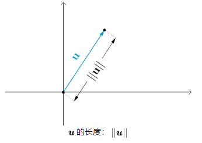
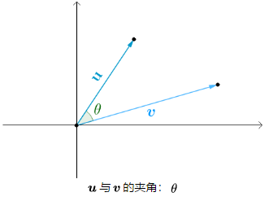
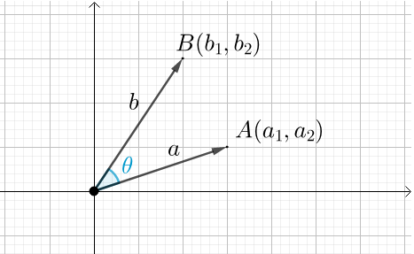
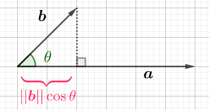

注意：这篇笔记包含LaTex-Math语法，由于github不支持该语法的解析，如需查看，请移步本人[GitHub Homepage](https://ming-lian.github.io/2019/03/31/Linear-Algebra-Note/)

<a name="content">目录</a>

[线性代数学习笔记](#title)
- [0. 线性代数的学科逻辑](#outline)
- [1. 理解向量与向量空间](#understand-vector-and-vector-space)
	- [1.1. 向量及向量的运算法则](#vector-and-rules)
	- [1.2. 线性表示与线性相关](#linear-representation-and-linear-correlation)
	- [1.3. 向量空间的定义及其特点](#vector-space)
	- [1.4. 向量空间的基](#base)
		- [1.4.1. 前期准备知识](#preliminary-for-base)
			- [1.4.1.1. 张量空间定义](#tensor-space)
			- [1.4.1.2. 等价向量组定义](#equivalent-vecor-set)
			- [1.4.1.3. 引出等价空间：张成空间相同 $\Leftrightarrow$ 可互相线性表示](#equivalent-space)
			- [1.4.1.4. 最大无关组](#biggest-uncorrelative-vector-set)
		- [1.4.2. 开始讲基](#talk-about-base)
			- [1.4.2.1. 基的定义以及基不唯一](#defination-of-base)
			- [1.4.2.2. 秩和维度](#rank-and-dimension)
			- [1.4.2.3. 基与坐标](#base-and-coordinate)
	- [1.5. 点积运算](#dot-product)
		- [1.5.1. 欧几里得空间=向量空间+点积](#euclid-space)
		- [1.5.2. 如何表示向量的长度和角度？](#how-to-indicate-vector-length-and-angle)
		- [1.5.3. 点积运算的几何意义](#geometric-meaning-of-dot-product)
		- [1.5.4. 余弦距离及其应用](#cos-distance)
	- [1.6. 总结](#chapter1-summary)
- [2. 理解矩阵与矩阵乘法](#understand-matrix-and-matrix-multiplication)
	- [2.1. 矩阵表示法和矩阵乘法规则是怎么来的？](#origin-of-matrix-representation)
		- [2.1.1. 求解线性方程组：高斯消元法](#solve-linear-system-of-equations)
		- [2.1.2. 简化线性方程组的表示——得到原始的矩阵定义](#original-defination-of-matrix)
		- [2.1.3. 用矩阵的表示方法表示高斯消元法解线性方程组的过程——得到矩阵乘法的原始定义](#original-defination-of-matrix-multiplication)
		- [2.1.4. 拆解高斯消元法得到3种基本操作——初等变换与初等矩阵](#parse-gaussian-elimination-get-elementary-transformation)
		- [2.1.5. 矩阵乘法的行观点、列观点以及点积观点](#understand-matrix-multiplication-in-view-of-row-and-column)
	- [2.2. 矩阵乘法的几何意义](#geometric-meaning-of-matrix-multiplication)
		- [2.2.1. 基的替换](#base-substitution)
			- [2.2.1.1. 矩阵映射法则——基的替换](#mapping-method-base-substitution)
			- [2.2.1.2. 基替换的一个实例——旋转矩阵](#example-of-base-substitution-orientation-matrix)
			- [2.2.1.3. 基本矩阵及其几何意义](#fundamental-matrix-and-its-geometric-meaning)
			- [2.2.1.4. 从矩阵直接看出其对应的几何变换](#make-sense-geometric-transformation-from-matrix)
		- [2.2.2. 点积——向新基的投影](#dot-multiply)
	- [2.3. 矩阵的其他运算法则](#other-algorithms-for-matrix)
		- [2.3.1. 矩阵加法](#add-in-matrix)
		- [2.3.2. 矩阵数乘](#scalar-multiply-in-matrix)
		- [2.3.3. 转置矩阵](#matrix-transposition)
- [3. 矩阵的秩：从函数的角度来看矩阵乘法](#matrix-rank)
	- [3.1. 从函数的角度来看矩阵乘法](#analysize-matrix-in-the-view-of-function)
		- [3.1.1. 矩阵乘法是函数](#matrix-multiplication-is-a-function)
		- [3.1.2. 区分是否是线性函数的两个条件：齐次性与可加性](#method-to-distinguish-linear-function)
		- [3.1.3. 矩阵乘法是线性函数](#matrix-multiplication-is-a-linear-function)
	- [3.2. 函数的基本概念及映射的几种情况](#basic-conception-of-function-and-mapping-types)
		- [3.2.1. 函数的基本概念](#basic-conception-of-function)
		- [3.2.2. 映射的几种情况](#mapping-types)
	- [3.2. 如何判断矩阵函数是那种映射类型？——引出矩阵的秩](#how-to-determine-mapping-type)
		- [3.2.1. 单射——列满秩](#injectipn-column-full-rank)
			- [3.2.1.1. 单射的直观印象与代数印象](#intuitive-and-algebra-impression-to-injectipn)
			- [3.2.1.2. 列空间定义及列空间与值域的关系](#defination-of-colspace-and-its-relation-with-value-range)
			- [3.2.1.3. 列秩=维度，列满秩$\Leftrightarrow$单射](#relation-between-colrank-and-dimension)
		- [3.2.2. 满射——行满秩](#surjection-row-full-rank)
			- [3.2.2.1. 单射的直观印象与代数印象](#intuitive-and-algebra-impression-to-surjection)
		- [3.2.3. 双射——满秩（列满秩+行满秩）](#bijection-col-and-row-full-rank)
		- [3.2.4. 行观点](#analysis-mapping-type-in-the-view-of-row)
	- [3.3. 矩阵秩的应用——逆矩阵：到达域 → 定义域](#application-of-matrix-rank-inverse-matrix)
		- [3.3.1. 反函数与反函数的存在性](#existence-of-inverse-function)
		- [3.3.2. 逆矩阵及其几何意义](#inverse-matrix-and-its-geometric-meaning)
		- [3.3.3. 求逆矩阵一：初等变换](#get-inverse-matrix-by-elementary-transformation)
		- [3.3.4. 求逆矩阵二：高斯-若尔当](#get-inverse-matrix-by-gauss-jordan-method)
	- [3.4. 秩的性质](#characters-of-matrix-rank)
		- [3.4.1. 行秩=列秩及其证明](#characters-of-matrix-rank-1)
		- [3.4.2. $r(PAQ)=r(A)$](#characters-of-matrix-rank-2)
		- [3.4.3. $r(BC)\le min\{r(B),r(C)\}$](#characters-of-matrix-rank-3)
	- [3.5. 如何求秩：初等变换求秩](#how-to-get-rank)
- [4. 矩阵方程](#matrix-equation)
	- [4.1. 矩阵方程解的三个问题](#3-main-problem-for-matrix-equation)
	- [4.2. 解的存在性](#existance-of-solution)
	- [4.3. 解的个数](#numbers-of-solution)
	- [4.4. 解集](#set-of-solution)
		- [4.4.1. 齐次方程的解集——零空间null(A)](#solution-set-of-quadraticformulation)
		- [4.4.2. 非齐次方程的解集——p+null(A)](#solution-set-of-unquadraticformulation)
		- [4.4.3. 求解非齐次矩阵方程的一般步骤](#common-process-to-get-solution-set-of-of-unquadraticformulation)
	- [4.5. 线性代数基本定理](#the-basic-theorem-of-linear-algebra)
		- [4.5.1. 行空间与零空间的关系](#relation-between-rowsp-and-zerosp)
			- [4.5.1.1. 行空间与零空间都是定义域的子集](#relation-between-rowsp-and-zerosp-1)
			- [4.5.1.2. 行空间与列空间正交](#relation-between-rowsp-and-zerosp-2)
			- [4.5.1.3. 行空间与零空间秩互补：秩零定理](#relation-between-rowsp-and-zerosp-3)
			- [4.5.1.4. 利用秩零定理快速求出齐次方程的解集](#use-rank-zero-theorem-to-solve-quadraticformulation)
- [5. 行列式](#determinant)
	- [5.1. 行列式的来历](#origin-of-determinant)
	- [5.2. 定义n阶行列式](#define-n-order-determinant)
		- [5.2.1. 先引入两个概念：全排列与逆序数](#introduct-2-terms-before-defination)
		- [5.2.2. 行列式的正式定义](#defination-of-determinant)
	- [5.3. 从二阶行列式看行列式的几何意义](#relation-between-linear-mapping-and-determinant)
		- [5.3.1. 行列式取值对应线性映射伸缩比及其代数推导](#derivation-relation-between-linear-mapping-and-determinant)
		- [5.3.2. 行列式取值范围及其对应的线性映射伸缩的几何意义](#geometric-meaning-of-determinant-value-range)
		- [5.3.3. 三维中有向面积表示法：向量积](#use-cross-products-to-present-directed-area)
			- [5.3.3.1. 向量积的定义与代数计算法则](#defination-of-cross-products)
			- [5.3.3.2. 向量积的代数运算法则](#calculate-algorithmn-of-cross-products)
	- [5.4. 三阶行列式的几何意义：有向体积并引出混合积运算](#geometric-meaning-of-3-order-determinant)
	- [5.5. n阶行列式的计算：推出代数余子式分解运算法](#3-order-determinant-and-hybrid-product-operation)
		- [5.5.1. 计算四阶行列式的有向超体积](#calculate-directed-volume-for-4-order-determinant)
		- [5.5.2. n阶行列式的计算：从几何意义的角度推导归纳计算公式](#calculate-n-order-determinant)
			- [5.5.2.1. 有向面积分解](#parse-directed-area)
			- [5.5.2.2. 有向体积分解](#parse-directed-volume)
		- [5.5.3. 计算高阶行列式：拉普拉斯展开](#calculate-high-order-determinant)
			- [5.5.3.1. 余子式与代数余子式](#cofactor-and-algebraic-cofactor)
			- [5.5.3.2. 拉普拉斯展开](#laplacian-expand)
- [6. 矩阵乘法的几何意义的另一个观察视角：基变换](#about-base-transformation)
	- [6.1. 基变换](#base-transformation)
		- [6.1.1. 什么是基变换](#what-is-base-transformation)
		- [6.1.2. 基变换的正向操作与反向操作](#forward-and-reverse-operation-of-base-transformation)
		- [6.1.3. 过渡矩阵：完成基变换的矩阵](#transition-matrix)
	- [6.2. 等价矩阵：不同基下的同一个映射](#equivalence-matrix)
		- [6.2.1. 线性映射中的基](#base-on-linear-mapping)
		- [6.2.2. 不同基下的同一个映射](#one-linear-mapping-on-different-bases)
		- [6.2.3. 等价矩阵](#defination-of-equivalence-matrix)
	- [6.3. 相似矩阵](#similar-matrix)
    	- [6.3.1. 线性变换结果可比较的前提：同基](#preconditions-to-compare-linear-transformation)
		- [6.3.2. 相似矩阵是等价矩阵的特殊情况](#what-is-similar-matrix)
	- [6.4. 相似矩阵的特征](#characteristic-of-similar-matrix)
        - [6.4.1. 特征值与特征向量](#eigenvalue-and-eigenvector)
    		- [6.4.1.1. 特征值与特征向量的定义](#defination-of-eigenvalue-and-eigenvector)
    		- [6.4.1.2. 特征值与特征向量的求解方法](#method-to-solve-eigenvalue-and-eigenvector)
    		- [6.4.1.3. 特征空间](#eigenspace)
            - [6.4.1.4. 特征值与特征空间](#eigenvalue-and-eigenspace)
        - [6.4.2. 相似矩阵的特征](#characteristic-list-of-similar-matrix)
        	- [6.4.2.1. 特征值相同](#same-eigenvalues)
        	- [6.4.2.2. 行列式相同，且为特征值乘积](#same-determinant)
        	- [6.4.2.3. 相似矩阵，特征值相同，但特征向量不一定相同](#same-eigenvalue-not-indicate-same-eigenvector)
        	- [6.4.2.4. 相似矩阵不仅有相同的特征值，而且还有相同的迹](#same-trace)
    - [6.5. 对角化：利用特征值和特征向量将矩阵对角化](#diagonalization)
        - [6.5.1. 对角化的好处](#advantages-of-diagonalization)
        - [6.5.2. 对角化的定义](#defination-of-diagonalization)
        - [6.5.3. 能否进行对角化的判断方法](#determine-the-feasibility-of-diagonalization)
- [7. 标准正交基和正交化](#normal-orthogonal-basis-and-orthogonal-matrix)
    - [7.1. 标准正交基](#normal-orthogonal-basis)
        - [7.1.1. 什么是标准正交基](#what-is-normal-orthogonal-basis)
        - [7.1.2. 标准正交基的“好”：非标准正交基会发生形变](#advantage-of-normal-orthogonal-basis)
        - [7.1.3. 自然基到标准基的坐标变换方法](#how-to-tranform-natural-basic-to-normal-basis)
        - [7.1.4. 正交矩阵：标准正交基之间的过渡矩阵](#orthogonal-matrix)
    - [7.2. 正交化](#orthogonalization)
        - [7.2.1. 施密特正交化的思路](#idea-of-schmidt-orthogonalization)
        - [7.2.2. 施密特正交化的推导](#deduce-of-schmidt-orthogonalization)
            - [7.2.2.1. 两个向量的正交化](#orthogonalization-for-2-vectors)
            - [7.2.2.2. 三个向量的正交化](#orthogonalization-for-3-vectors)
            - [7.2.2.3. n个向量的正交化](#orthogonalization-for-n-vectors)
- [补充知识](#supplimentry)
	- [*1. 矩阵运算的一个技巧：分块矩阵](#block-matrix)
		- [*1.1. 数乘、加法与乘法](#block-matrix-1)
		- [*1.2. 转置与求逆](#block-matrix-2)
		- [*1.3. 证明西尔维斯特不等式](#prove-sylvester-inequality)
	- [*2. 二次型](#quadratic-forms)
		- [*2.1. 二次函数的特点及它的矩阵表示](#characteristics-of-quadratic-forms-and-its-matrix-like-represent)
		- [*2.2. 通过矩阵来研究的好处](#benefit-of-matrix-representation)
	- [*3. 仿射变换](#affine-transformation)
		- [*3.1. 什么是仿射变换？](#what-is-affine-transformation)
		- [*3.2. 通过线性变换来完成仿射变换](#acheive-affine-transformation-by-linear-transformation)
	- [*4. 理解矩阵特征值和特征向量](#understand-eigenvalue-eigenvector)
		- [*4.1. 几何意义](#geometric-interpretation)
		- [*4.2. 特征值、特征向量与运动的关系](#relation-between-eigenvalue-eigenvector-and-movement)
	- [*5. 相似矩阵](#similar-matrix)
		- [*5.1. 相似矩阵的定义及其几何意义](#defination-and-geometric-interpretation-of-similar-matrix)
		- [*5.2. 相似矩阵有什么用？](#usage-of-similar-matrix)
	- [*6. 理解奇异值](#understand-singular-value)

<h1 name="title">线性代数学习笔记</h1>

<a name="understand-vector-and-vector-space"><h2>0. 线性代数的学科逻辑 [目录](#content)</h2></a>

<a name="understand-vector-and-vector-space"><h2>1. 理解向量与向量空间 [目录](#content)</h2></a>

<a name="vector-and-rules"><h3>1.1. 向量及向量的运算法则 [目录](#content)</h3></a>

向量的表示方式：

> 将有向线段的起点与终点分别表示为字母$A$、$B$。则向量表示为$\overrightarrow{AB}$，头上的箭头方向表示由A指向$B$；
>
> 只要长短相同、方向一致，向量就相等，否则不等：

在数学中，始终把向量的起点放在原点O，那么就可以用终点的坐标来表示向量，则

$$\vec u=(m,n)$$

向量的运算法则：

- 向量加法

	$$\vec a=\begin{pmatrix}a_1\\\\a_2\\\\.\\\\.\\\\.\\\\a_n\end{pmatrix}\quad \vec b=\begin{pmatrix}b_1\\\\b_2\\\\.\\\\.\\\\.\\\\b_n\end{pmatrix}$$

	$$\vec a + vec b=\begin{pmatrix}a_1\\\\a_2\\\\.\\\\.\\\\.\\\\a_n\end{pmatrix} + \begin{pmatrix}b_1\\\\b_2\\\\.\\\\.\\\\.\\\\b_n\end{pmatrix}=\begin{pmatrix}a_1+b_1\\\\a_2+b_2\\\\.\\\\.\\\\.\\\\a_n+b_n\end{pmatrix}$$

- 数乘

	数乘的几何意义：对$\vec u$进行缩放

	$$k\vec a=k\begin{pmatrix}a_1\\\\a_2\\\\.\\\\.\\\\.\\\\a_n\end{pmatrix}=\begin{pmatrix}ka_1\\\\ka_2\\\\.\\\\.\\\\.\\\\ka_n\end{pmatrix}$$

一道证明题：

> A、B、O为三角形的三个顶点，M为AB的中点，证明：
>
> $$\overrightarrow{OM}=\frac 12(\overrightarrow{OA}+\overrightarrow{OB})$$
>
> 

>
> 证明：
>
> $$\overrightarrow{OM}=\overrightarrow{OA}+\overrightarrow{AM}\\\\ \overrightarrow{OM}=\overrightarrow{OB}+\overrightarrow{BM}\\\\ 2\overrightarrow{OM}=\overrightarrow{OA}+\overrightarrow{OB}+\overrightarrow{AM}+\overrightarrow{BM}$$
>
> 则
>
> $$\overrightarrow{OM}=\frac 12(\overrightarrow{OA}+\overrightarrow{OB})$$

<a name="linear-representation-and-linear-correlation"><h3>1.2. 线性表示与线性相关 [目录](#content)</h3></a>

向量组：

> 若干同维数的列向量（或者同维数的行向量）所组成的几何，如：
>
> $$\{R,G,B\}=\left\{\begin{pmatrix}255\\\\0\\\\0\end{pmatrix},\begin{pmatrix}0\\\\255\\\\0\end{pmatrix},\begin{pmatrix}0\\\\0\\\\255\end{pmatrix} \right\}$$

线性表示与线性组合：

> 给定向量组A:$\boldsymbol{a_1},\boldsymbol{a_2},...\boldsymbol{a_m}$和向量$\boldsymbol{b_{}}$，如果存在一组实数$k_1,k_2,...k_m$，使：
>
> $$\boldsymbol{b_{}}=k_1\boldsymbol{a_1}+k_2\boldsymbol{a_2}+...+k_m\boldsymbol{a_m}$$
>
> 则称向量$\boldsymbol{b_{}}$能由向量组A$\color{Salmon}{线性表示}$，也可以说向量$\boldsymbol{b_{}}$是向量组A的$\color{Salmon}{线性组合}$

线性无关与线性相关：

> 给定向量组$A:a_1,a_2,...a_m$，如果存在不全为零的实数$k_1,k_2,...k_m$，使：
>
> $$k_1a_1+k_2a_2+...+k_ma_m=0$$
>
> 则称向量组A是**线性相关**的，否则称它为**线性无关**

<a name="vector-space"><h3>1.3. 向量空间的定义及其特点 [目录](#content)</h3></a>

向量空间应该包含以下的特点：

- 包含向量；

- 向量的“运动”依然在空间中；

**（1）包含向量**

向量组就包含向量：

$$V=\{\boldsymbol{v_1},\boldsymbol{v_2},\cdots,\boldsymbol{v_n}\}$$

并且向量组可以保证内部的向量维数相同

**（2）向量的“运动”依然在空间中**

向量的“运动”，在此处指的是，数乘和加法。因为数乘和加法不会改变向量的维数

“向量的运动依然在空间中”，翻译成数学语言就是：

> 某向量组V，从中随便选两个向量：
>
> $$\boldsymbol{v_1}\in V,\quad \boldsymbol{v_2}\in V$$
>
> 如果进行数乘和加法的“运动”，结果依然在V中，即：
>
> $$\boldsymbol{v_1}+\boldsymbol{v_2}\in V\qquad k\boldsymbol{v_1}\in V$$
>
> 那么V就是向量空间

练习：

> 向量组：
>
> $$V=\{(x,y)\mid x^2+y^2 \le 1\}$$
>
> 表示如下区域的所有的点：
>
> 

>
> 那么$V$是一个向量空间吗？
>
> 答：$V$不是一个向量空间，因为随便从V中选出两个向量：
>
> 

>
> 相加得到的向量已经超出这个区域了：
>
> 

向量空间的严格定义：

> 设V为一向量组，如果V非空，且V对于向量的加法及数乘两种运算封闭，那么就称V为**向量空间**
>
> 所谓封闭，是指在V中向量进行数乘和加减，其结果依然在V中。具体的说，就是:
>
> - 若$\boldsymbol{a}\in V,\boldsymbol{b}\in V$，则$\boldsymbol{a}+\boldsymbol{b} \in V$
>
> - 若$\boldsymbol{a}\in V,k\in \mathbb{R}$，则$k\boldsymbol{a} \in V$

思考：是否向量空间必须包含零向量？

> 对
>
> 假设V为由n维向量构成的向量空间。任取其中两向量$\boldsymbol{u_1}$、$\boldsymbol{u_2}$，有：
>
> $$0\boldsymbol{u_1}+0\boldsymbol{u_2}=(0,0,\cdots,0)$$
>
> 因此向量空间必含零向量

子空间：

> 向量空间并不一定是$\mathbb{R^n}$，也可以是它们的子集
>
> 比如$\mathbb{R^3}$中的一个点，一根直线，或者一个面
>
> 

>
> 注意，子空间一定要包含零向量

练习：

> 针对向量组：
>
> $$V=\{(x_1,x_2,0)|x_{1,2,}\in\mathbb{R}\}$$
>
> V是向量空间，但既不是$\mathbb{R^2}$也不是$\mathbb{R^3}$
>
> 因为：
>
> - V中元素由三维向量构成，因此不是$\mathbb{R^2}$
> - V并不包含所有的三维向量，因此也不是$\mathbb{R^3}$

<a name="base"><h3>1.4. 向量空间的基 [目录](#content)</h3></a>

<a name="preliminary-for-base"><h4>1.4.1. 前期准备知识 [目录](#content)</h4></a>

<a name="tensor-space"><h5>1.4.1.1. 张量空间定义 [目录](#content)</h5></a>

向量组的所有线性组合构成的向量空间**张成空间**，在数学中是如下描述的：

> 某向量组$\{\boldsymbol{v_1},\boldsymbol{v_2},...,\boldsymbol{v_p}\}$，其所有线性组合构成的集合称为向量组$\{\boldsymbol{v_1},\boldsymbol{v_2},...,\boldsymbol{v_p}\}$的**张成空间**，记为$span(\boldsymbol{v_1},\boldsymbol{v_2},...,\boldsymbol{v_p})$，即：
>
> $$span(\boldsymbol{v_1},\boldsymbol{v_2},...,\boldsymbol{v_p})=\{k_1\boldsymbol{v_1}+k_2\boldsymbol{v_2}+...+k_p\boldsymbol{v_p},k_{1,2,...,p}\in\mathbb{R}\}$$
>
> 我们也称$span(\boldsymbol{v_1},\boldsymbol{v_2},...,\boldsymbol{v_p})$为向量组$\{\boldsymbol{v_1},\boldsymbol{v_2},...,\boldsymbol{v_p}\}$所**张成**

比如，色彩空间其实就是$\{RGB\}$的张成空间：

$$色彩空间=span(\boldsymbol{R},\boldsymbol{G},\boldsymbol{B})$$

再比如，向量组$\{\boldsymbol{u}=(1,0,0),\boldsymbol{v}=(0,1,0),\boldsymbol{w}=(0,0,1)\}$

其张成空间为：

$$\mathbb{R^3}=span(\boldsymbol{u},\boldsymbol{v},\boldsymbol{w})$$

<a name="equivalent-vecor-set"><h5>1.4.1.2. 等价向量组定义 [目录](#content)</h5></a>

光线混合：RGB $\Rightarrow$ 适用于屏幕显示

颜料混合：CMY（C-青色，M-洋红，Y-黄色）$\Rightarrow$ 适用于印刷

不论是电脑屏幕还是印刷的书籍，都可以看到RGB以及CMY这六种颜色：

$$RGB \quad \leftrightarrow CMY$$

数学中就说这两种颜色是等价的

> 设有两个向量组$A:\{\boldsymbol{a_1},\boldsymbol{a_2},...,\boldsymbol{a_m}\}$及$B:\{\boldsymbol{b_1},\boldsymbol{b_2},...\boldsymbol{b_l}\}$，若B组中的每个向量都能由向量组A线性表示，则称向量组B能由向量组A线性表示
>
> 若向量组A与向量组B能相互线性表示，则称这两个向量组**等价**，也可以说A和B是**等价向量组**

<a name="equivalent-space"><h5>1.4.1.3. 引出等价空间：张成空间相同 $\Leftrightarrow$ 可互相线性表示 [目录](#content)</h5></a>

RGB和CMY是等价的，很显然它们可以张成同一个色彩空间

更一般的：

> 有两个向量组：
>
> $$A=\{\boldsymbol{a_1},\boldsymbol{a_2},...,\boldsymbol{a_n}\},\quad B=\{\boldsymbol{b_1},\boldsymbol{b_2},...,\boldsymbol{b_m}\}$$
>
> 则：
>
> $$A和B等价\iff span(A)=span(B)$$

等价向量组、张成空间的几何意义：

> 根据几何知识，交于原点的两条直线可以唯一确定一个平面：
>
> 

>
> 在两条直线上各找一个向量：
>
> 

>
> 这两个向量可以张成该平面：
>
> $$span(\boldsymbol{u},\boldsymbol{v})=k_1\boldsymbol{u}+k_2\boldsymbol{v},\quad k_{1,2}\in\mathbb{R}$$
>
> 随便在该平面上找另外两条过原点的直线，并在这两条直线上找两个向量：
>
> 

>
> 这两根直线决定了同样的平面，所以新找到的两个向量也可以张成该平面：
>
> $$span(\boldsymbol{w},\boldsymbol{h})=r_1\boldsymbol{w}+r_2\boldsymbol{h},\quad r_{1,2}\in\mathbb{R}$$
>
> 这两个向量组张成的是同一个平面：
>
> $$span(\boldsymbol{u},\boldsymbol{v})=span(\boldsymbol{w},\boldsymbol{h})$$
>
> 并且这两个向量组可以相互线性表示，即$\{\boldsymbol{u},\boldsymbol{v}\}$与$\{\boldsymbol{w},\boldsymbol{h}\}$等价

<a name="biggest-uncorrelative-vector-set"><h5>1.4.1.4. 最大无关组 [目录](#content)</h5></a>

> 设有向量组A，如果在A中能选出r个向量$\boldsymbol{a_1},\boldsymbol{a_2},...,\boldsymbol{a_r}$满足：
>
> - 向量组$A_0=\{\boldsymbol{a_1},\boldsymbol{a_2},...,\boldsymbol{a_r}\}$线性无关
>
> - 向量组A中任意r+1个向量（如果A中有r+1个向量的话）都线性相关
>
> 那么称向量组$A_0$是向量组A的一个**最大线性无关组**（简称**最大无关组**）

最大无关组的几何意义：

> 过原点的两条直线可以确定一个平面，在这两条直线上取向量，可以张成该平面，再夺取一条直线就多余了
>
> 因此，在该平面上任取两条不平行的向量，可以得到A的最大无关组$A_0$

<a name="talk-about-base"><h4>1.4.2. 开始讲基 [目录](#content)</h4></a>

<a name="defination-of-base"><h5>1.4.2.1. 基的定义以及基不唯一 [目录](#content)</h5></a>

基的定义：

> V为向量空间，如果其中的某个向量组：
>
> $$A=\{a_1,a_2,...,a_r\}$$
>
> 是V的最大无关组，那么向量组A被称为向量空间的一个基

基不唯一：

> 对于向量空间而言，基一般都有多个：
>
> 比如，RGB和CMY都可以张成整个颜色空间，因此，RGB和CMY都是颜色空间的基，用哪个基取决于用途：
>
> - 电脑出图时用RGB基；
> - 印刷时使用CMY基；

附加知识：

> 在电视转播中还会将RGB转成Y'CrCb基，这主要是为了兼容黑白电视，因为Y'分量是黑白的，这样黑白电视可以只播放这一个分量的视频

<a name="rank-and-dimension"><h5>1.4.2.2. 秩和维度 [目录](#content)</h5></a>

秩的定义：

> 假设向量组A的最大无关组为：
>
> $$A_0=\{a_1,a_2,...,a_r\}$$
>
> $A_0$的向量个数r就是向量组A的秩（rank），记作$rank(A)$，也记作$r(A)$
>
> 只含有零向量的向量组没有最大无关组，它的秩为0

最大无关组个数r $\Leftrightarrow$ 秩 $\Leftrightarrow$ 向量空间的维度

举例：

两条过原点的相交直线决定一个平面

这个平面是向量空间，此向量空间的基为：

$$A=\{u,v\}$$

很显然

$$rank(A)=2$$

所以这个向量空间的维度是2

<a name="base-and-coordinate"><h5>1.4.2.3. 基与坐标 [目录](#content)</h5></a>

RGB和CMY都是颜色空间的基，同一种颜色子啊不同的基下数值是不一样的

为了分清具体在哪个基下，我们把基标注在右下角：

$$粉暖=\begin{pmatrix}212 \\\\ 125 \\\\ 124\end{pmatrix}_{RGB}\quad 粉暖=\begin{pmatrix}0 \\\\ 63 \\\\ 38\end{pmatrix}_{CMY}$$

这些不同的值称为在基下的坐标

在确定坐标基后，向量空间中的任意向量的表示方式：

> 在向量空间V中取一个基$A=\{a_1,a_2,...,a_r\}$，那么V中某向量X可以唯一地表示为：
>
> $$X=k_1a_1+k_2a_2+...+k_ra_r$$
>
> $k_1,k_2,...,k_r$称为向量X在基$\{a_1,a_2,...,a_r\}$下的坐标
>
> X在此基下可以表示为：
>
> $$X=\begin{pmatrix}k_1 \\\\ k_2 \\\\ . \\\\ . \\\\ . \\\\ k_r\end{pmatrix}_A$$

在标准笛卡尔坐标系下，我们通常会选取的基为：

$$e_1=\begin{pmatrix}1 \\\\ 0 \end{pmatrix} \quad e_2=\begin{pmatrix}0 \\\\ 1 \end{pmatrix}$$

约定：如果不明确说在哪个基下，那就是在自然基下，不需要带下标

<a name="dot-product"><h3>1.5. 点积运算 [目录](#content)</h3></a>

先给出点积运算的定义：

> 在向量空间$\mathbb{R}^n$中，自然基下，向量$\boldsymbol{x}=(x_1,\ldots,x_n)$和 $\boldsymbol{y}=(y_1,\ldots,y_n)$的$\color{Salmon}{点积}$(dot product)，或称$\color{Salmon}{内积}$(inner product)，定义为：
>
> $$\boldsymbol{x}\cdot\boldsymbol{y}=x_1y_1+\cdots+x_ny_n=\displaystyle\sum_{i=1}^{n}x_iy_i$$

<a name="euclid-space"><h4>1.5.1. 欧几里得空间=向量空间+点积 [目录](#content)</h4></a>

之前介绍的向量空间，缺失了欧式几何中的很重要的两个概念：长度和角度

| ` ` | ` ` |
|:---:|:---:|
|| |

注：

> 在向量空间中，只有两种运算规则：向量加法和向量数乘
>
> 在这仅有的两种运算规则下，是无法得到指定向量的长度以及指定两个向量之间的角度的

给向量空间添加长度和角度，只需要添加一个运算：点积

增加了长度和角度的向量空间，就是**欧几里得空间**：

> - 首先是一个向量空间；
> - 在此基础上定义了点击运算；

<a name="how-to-indicate-vector-length-and-angle"><h4>1.5.2. 如何表示向量的长度和角度？ [目录](#content)</h4></a>

- **用点积表示向量的角度**

	在自然基下：

	

	$$\cos \theta = \frac{a_1b_1+a_2b_2}{||\vec a||·||\vec b||}$$

	证明：

	> 根据欧氏几何中的余弦定理，我们可以得到：
	>
	> $$AB^2=OA^2+OB^2-2OA\cdot OB\cos\theta$$
	>
	> 进而，通过向量表示出：
	>
	> $$||\boldsymbol{\vec a}-\boldsymbol{\vec b}||^2=||\boldsymbol{\vec a}||^2+||\boldsymbol{\vec b}||^2-2||\boldsymbol{\vec a}||·||\boldsymbol{\vec b}||
	\cos\theta$$
	>
	> 而
	>
	> $$\begin{aligned} &\quad ||\boldsymbol{\vec a}-\boldsymbol{\vec b}|| \\\\ &= ||(a_1,a_2)-(b_1,b_2)||\\\\ &=||(a_1-b_1,a_2-b_2)||\\\\ &=\sqrt{(a_1-b_1)^2+(a_2-b_2)^2} \end{aligned}$$
	>
	> 所以
	>
	> $$
	\begin{aligned} &\quad ||\boldsymbol{\vec a}-\boldsymbol{\vec b}||^2 \\\\ &=(a_1-b_1)^2+(a_2-b_2)^2\\\\ &=\underbrace{(a_1^2+a_2^2)}_{||\boldsymbol{a}||^2}+\underbrace{(b_1^2+b_2^2)}_{||\boldsymbol{b}||^2}-2a_1b_1-2a_2b2\\\\ &=||\boldsymbol{a}||^2+||\boldsymbol{b}||^2-2||\boldsymbol{a_{}}||||\boldsymbol{b_{}}||\cos\theta \end{aligned}$$
	>
	> 整理一下，得到：
	>
	> $$\cos \theta = \frac{a_1b_1+a_2b_2}{||\vec a||·||\vec b||}$$

	将向量的点击运算定义为：

	$$\boldsymbol{\vec a}\cdot\boldsymbol{\vec b}=a_1b_1+a_2b_2$$

	那么：

	$$cos\theta=\displaystyle\frac{a_1b_1+a_2b_2}{||\boldsymbol{a_{}}||\cdot||\boldsymbol{b_{}}||}=\displaystyle\frac{\boldsymbol{\vec a}\cdot\boldsymbol{\vec b}}{||\boldsymbol{\vec a}||\cdot||\boldsymbol{\vec b}||}$$

	算出了$\cos\theta$，则就可以算出$\theta = \cos^{-1}\theta$

- **用点积表示向量的长度**

	向量的长度计算公式：

	$$||\vec a|| = \sqrt{a_1^2+a_2^2}$$

	证明：

	> 该公式可以由点积运算推导出来：
	>
	> 因为 $\vec a \cdot \vec b=a_1b_1+a_2b_2$
	>
	> 所以 $\vec a \cdot \vec a=a_1^2+a_2^2=||\vec a||^2$
	>
	> 因此 $||\vec a|| = \sqrt{a_1^2+a_2^2}$

<a name="geometric-meaning-of-dot-product"><h4>1.5.3. 点积运算的几何意义 [目录](#content)</h4></a>

我们知道：

$$\boldsymbol{a}\cdot\boldsymbol{b}=||\boldsymbol{a}||\cdot||\boldsymbol{b}||\cos\theta$$

其中$||\boldsymbol{b}||\cos\theta$可以看作$\boldsymbol{b}$在$\boldsymbol{a}$上的投影：

所以，可以把$\boldsymbol{a}\cdot\boldsymbol{b}$看作矩形A的面积：

<a name="1.6. 总结"><h3>1.6. 总结 [目录](#content)</h3></a>

向量及向量表示

多个向量组成向量组

向量组内的各个向量之间线性相关或线性无关

可以将线性无关的向量组看作是向量空间的基，它们所有可能的线性组合形式构成其对应的向量空间，称为该向量空间是由这些向量组成的向量组张成的，即 $span(v_1,v_2)$，当两个不同的向量组其张成的向量空间相同，则它们是等价向量组，它们的差别仅仅在于所选择的基不同而已

若原始向量组线性相关，即存在向量可以由其他向量线性表示，则该向量就是该向量组中的冗余向量，将所以的冗余向量剔除后，就得到了原始向量组的最大线性无关组

最大无关组个数r $\Leftrightarrow$ 秩 $\Leftrightarrow$ 向量空间的维度

向量空间中由于只定义了向量加法和向量数乘这两种运算规则，缺少了计算给定向量的长度或给定两个向量之间角度的计算方法，也就是说向量空间未定义向量的长度和角度，为此需要引入新的运算规则——点积运算

点积运算的几何意义为以第二个向量向第一个向量的投影长度为宽/长，以第一个向量长度为长/宽的矩形的面积

<a name="understand-matrix-and-matrix-multiplication"><h2>2. 理解矩阵与矩阵乘法 [目录](#content)</h2></a>

<a name="origin-of-matrix-representation"><h3>2.1. 矩阵表示法和矩阵乘法规则是怎么来的？ [目录](#content)</h3></a>

<a name="solve-linear-system-of-equations"><h4>2.1.1. 求解线性方程组：高斯消元法 [目录](#content)</h4></a>

电视的转播过程是这样的：

因此从电视信号线传过来的是YCrCb三个颜色通道的数字信号，此时如果使用的是彩色电视，就需要

$$YCrCb \to^{转换} RGB$$

这种信号编码方式的转换本质上就是在解方程组：

$$
\begin{cases}
0.299R & + & 0.587G & + & 0.114B & = & Y \\\\
0.500R & - & 0.419G & - & 0.081B & + & 128 & = & Cr \\\\
-0.169R & - & 0.331G & + & 0.500B & + & 128 & = & Cb
\end{cases}
$$

那么如何解这个线性方程组呢？

我们大家都学过的一种比较通用的方法就是**高斯消元法**

得到最终结果：

$$
\begin{cases}
x & + & 0 & + & 0 & = & \frac{e_3}{a_{11}} \\\\
0 & + & y & + & 0 & = & \frac{f_3}{b_{22}} \\\\
0 & + & 0 & + & z & = & \frac{g_3}{c_{33}}
\end{cases}
$$

<a name="original-defination-of-matrix"><h4>2.1.2. 简化线性方程组的表示——得到原始的矩阵定义 [目录](#content)</h4></a>

当然，解线性方程组使用高斯消元法，基本上就是最优的求解方法，但是整个求解过程若按照上面这样去表示，表示起来是比较复杂的

因此有一个英国的数学家叫**阿瑟·凯莱**就提出用矩阵去表示线性方程组，以及线性方程组的求解过程

以一个简单的线性方程组为例进行说明：

$$
\begin{cases}
x & + & 2y & = & 3 \\\\
3x & + & 4y & = & 5
\end{cases}
$$

对于上述方程组，未知数x，y根本不重要，所以可以用一种称为**矩阵**的紧凑的阵列来表示，把未知数的系数提出来：

$$
\begin{bmatrix}
1 & 2 \\\\
3 & 4
\end{bmatrix}
$$

称为系数矩阵，而把等号右边的数字一起提出来：

$$
\left[
	\begin{array}{cc|c}
	1 & 2 & 3 \\\\
	3 & 4 & 5
	\end{array}
\right]
$$

称为**增广矩阵**

<a name="original-defination-of-matrix-multiplication"><h4>2.1.3. 用矩阵的表示方法表示高斯消元法解线性方程组的过程——得到矩阵乘法的原始定义 [目录](#content)</h4></a>

还是以上面提到的方程组为例进行说明

高斯消元法的目标是进行下面形式的转换：

$$
\begin{cases}
x & + & 2y & = & 3 \\\\
3x & + & 4y & = & 5
\end{cases}

\to

\begin{cases}
x & + & 0y & = & ? \\\\
0 & + & y & = & ?
\end{cases}
$$

用矩阵表示就是：

$$
\begin{bmatrix}
& 1 & 2 & 3 & \\\\
& 3 & 4 & 5 &
\end{bmatrix}
\to
\begin{bmatrix}
& 1 & 0 & ? & \\\\
& 0 & 1 & ? &
\end{bmatrix}
$$

我们来看对这个原始方程组用高斯消元法进行消元的第一步

$$
\begin{cases}
x & + & 2y & = & 3 & 【方程1】 & \\\\
3x & + & 4y & = & 5 & 【方程2】 &
\end{cases}
矩阵表示为
\left[
	\begin{array}{cc|c}
	1 & 2 & 3 \\\\
	3 & 4 & 5
	\end{array}
\right]
$$

用第一个方程消去第二个方程的第一个系数：

$$
\frac
{
	\begin{matrix}
	& -3 & 【方程1】 \\\\
	+ & & 【方程2】
\end{matrix}}
{【新方程2】}
$$

得到

$$
\begin{cases}
x & + & 2y & = & 3 & \\\\
0x & - & 2y & = & -4 &
\end{cases}
矩阵表示为
\left[
	\begin{array}{cc|c}
	1 & 2 & 3 \\\\
	0 & -2 & -4 
	\end{array}
\right]
$$

> 我们已经成功尝试利用矩阵来表示方程组了，但是好像对方程组的求解并没有什么用，那么我们能否利用矩阵表示方式来简化方程组的求解过程呢？

首先，可以将矩阵$\begin{matrix}& 1 & 2 & 3 & \\\\& 3 & 4 & 5 &\end{matrix}$看作是两个行向量$\begin{matrix}& r_1 & \\\\& r_2 & \end{matrix}$，那么上面的计算可以通过矩阵表示为：

$$
\begin{bmatrix}
& 1 & 2 & 3 & \\\\
& 3 & 4 & 5 & 
\end{bmatrix}
\begin{matrix}
r_2'=-3r_1+r_2 \\\\
\to
\end{matrix}
\begin{bmatrix}
& 1 & 2 & 3 & \\\\
& 0 & -2 & -4 &
\end{bmatrix}
$$

这个过程实际上包含了两个步骤：

- 第一行不变，即：$r_1' = r_1$
- 第二行改变，即：$r_2'=-3r_1+r_2$

首先第一行不变，即

其次，第二行改变，即

凯莱规定，把第一行运算的结果放在第一行，第二行的结果放在第二行，即

<a name="parse-gaussian-elimination-get-elementary-transformation"><h4>2.1.4. 拆解高斯消元法得到3种基本操作——初等变换与初等矩阵 [目录](#content)</h4></a>

高斯消元法只需要三种操作就可以完成，如果把这三种操作应用到单位阵上可得三种矩阵：

$$
\begin{array}{c|c|c} 
	\hline
    \quad 名称\quad &\quad 操作\quad &\quad 应用到单位阵\quad\\\\
    \hline
    \\\\
    \quad \color{SkyBlue}{倍加变换}\quad &\quad \boldsymbol{r_1}'=\boldsymbol{r_1}+k\boldsymbol{r_2}\quad &\quad \begin{pmatrix}1&{\color{red}{k}}&0\\\\0&1&0\\\\0&0&1\end{pmatrix}\quad
    \\\\
    \\\\
    \hline
    \\\\
    \quad \color{Goldenrod}{倍乘变换}\quad &\quad \boldsymbol{r_1}'=k\boldsymbol{r_1} (k\neq 0)\quad &
    \quad \begin{pmatrix}{\color{red}{k}}&0&0\\\\0&1&0\\\\0&0&1\end{pmatrix}\quad \\\\
    \\\\
    \hline
    \\\\
    \quad \color{orange}{对换变换}\quad &\quad \boldsymbol{r_1}\leftrightarrow \boldsymbol{r_2}\quad &
    \quad \begin{pmatrix}{\color{red}{0}}&{\color{red}{1}}&{\color{red}{0}}\\\\
    {\color{red}{1}}&{\color{red}{0}}&{\color{red}{0}}\\\\0&0&1\end{pmatrix}\quad \\\\
    \\\\
	\hline
\end{array}
$$

这三种操作是对矩阵的行进行的，所以称为**初等行变换**，当然可以对列进行这三种操作，那就是**初等列变换**，如何进行，我们下节才会讲，这里暂时先给出定义。

因为只需要对单位阵实施初等变换，就可以对任意矩阵进行初等变换。比如对换变换：

对单位阵实施一次初等变换得到的矩阵称为：初等矩阵

<a name="understand-matrix-multiplication-in-view-of-row-and-column"><h4>2.1.5. 矩阵乘法的行观点、列观点以及点积观点 [目录](#content)</h4></a>

首先，需要说明一下矩阵乘法的合法性：

> - $m\times n$ 的矩阵只能和 $n\times p$ 的矩阵相乘；
> - 相乘后的矩阵大小为 $m\times p$

- 行观点

	$$xA=y$$

	

	称为A右乘x

- 列观点

	$$Ax=y$$

	

	称为A左乘x

- 点积观点

	

	这个非常适合用来口算矩阵乘法

<a name="geometric-meaning-of-matrix-multiplication"><h3>2.2. 矩阵乘法的几何意义 [目录](#content)</h3></a>

矩阵函数是一个向量空间向另一个向量空间的映射

例（一）

$$
A=
\begin{bmatrix}
1 & -1 \\\\
1 & 1
\end{bmatrix}
\quad
x=
\begin{bmatrix}
x_1 \\\\
x_2
\end{bmatrix}
\quad
y=
\begin{bmatrix}
y_1 \\\\
y_2
\end{bmatrix}
$$

$$Ax=y$$

则为从$\mathbb{R}^2 \Rightarrow \mathbb{R}^2$

例（二）

$$
\begin{bmatrix}
1 & -1 \\\\
1 & 1 \\\\
1 & 2
\end{bmatrix}
\begin{bmatrix}
x_1 \\\\
x_2
\end{bmatrix}
=
\begin{bmatrix}
y_1 \\\\
y_2 \\\\
y_3
\end{bmatrix}
$$

则为从$\mathbb{R}^2 \Rightarrow \mathbb{R}^3$

<a name="base-substitution"><h4>2.2.1. 基的变换 [目录](#content)</h4></a>

<a name="mapping-method-base-substitution"><h5>2.2.1.1. 矩阵映射法则——基的变换 [目录](#content)</h5></a>

在$\mathbb{R}^2$的向量空间中，它的自然基（笛卡尔坐标系）为：

$$\vec i=\begin{bmatrix} 1 \\\\ 0 \end{bmatrix}\quad \vec j=\begin{bmatrix} 0 \\\\ 1 \end{bmatrix}$$

令 $A=\begin{bmatrix} 1 & -1 \\\\ 1 & 1 \end{bmatrix}$

自然基下向量 $a=\begin{bmatrix} 1 \\\\ 1 \end{bmatrix}=1 \vec i+1 \vec j$

则 $Aa=b$ 根据矩阵乘法

$$
Aa=
\begin{bmatrix} 
1 & -1 \\\\
1 & 1 
\end{bmatrix}
\begin{bmatrix}
1 \\\\
1 
\end{bmatrix}
=
1\begin{bmatrix} 1 \\\\ 1 \end{bmatrix} + 1\begin{bmatrix} -1 \\\\ 1 \end{bmatrix}
=
\begin{bmatrix} 0 \\\\ 2 \end{bmatrix}
=b
$$

为了看起来更清晰，我们令

$$\vec c_1 = \begin{bmatrix} 1 \\\\ 1 \end{bmatrix} \quad \vec c_2 = \begin{bmatrix} -1 \\\\ 1 \end{bmatrix}$$

则 $A=[\vec c_1 \quad \vec c_2]$，因此$Aa=b$可以表示成以下形式：

$$
a = 1 \vec i + \vec j \quad \begin{matrix} A \\\\ \rightarrow \end{matrix} \quad b = 1 \vec c_1 + 1 \vec c_2
$$

从上面很容易能看出，这个矩阵的乘法规则就是：保持系数不变，但是自然基被矩阵列向量给替换了

从几何上感受一下

再将向量用自然基表示

整体来说，就是基改变，导致向量的坐标发生变化：

<a name="example-of-base-substitution-orientation-matrix"><h5>2.2.1.2. 基变换的一个实例——旋转矩阵 [目录](#content)</h5></a>

通过旋转矩阵$\begin{bmatrix} \cos\theta & -\sin\theta \\\\ \sin\theta & \cos\theta\end{bmatrix}$，可以让$\mathbb{R}^2$中的x旋转$\theta$角得到y

来理解一下旋转矩阵是怎么做到的

单位圆中，与x轴夹角为$\theta$的向量表示如下：

则

再看看另一个正交向量的旋转

根据三角公式有

$$
\begin{cases}
-\sin\theta = \cos(\frac \pi2 + \theta) \\\\
\cos\theta = \sin(\frac \pi2 + \theta)
\end{cases}
$$

则向量 $\begin{bmatrix} -\sin\theta \\\\ \cos\theta \end{bmatrix}$表示的是有y轴夹角为$\theta$的向量，则

结合之前对映射法则的讲解，就可以理解旋转矩阵了：

> 旋转矩阵的原理，就是通过旋转基来实现的

<a name="fundamental-matrix-and-its-geometric-meaning"><h5>2.2.1.3. 基本矩阵及其几何意义 [目录](#content)</h5></a>

- 单位矩阵

	什么都不改变的矩阵称为单位矩阵：

	

- 伸缩矩阵

	在某个基(或每个基)方向上进行了缩放

	

- 旋转矩阵

	围绕原点，几何图形进行了旋转。下图是沿逆时针旋转了$\theta$角：

	

- 剪切矩阵

	剪切矩阵，是通过在某个基上平移c，将正方形变换成一般平行四边形

	选取 $\boldsymbol{i},\boldsymbol{j}$ 为基，下图是在 $\boldsymbol{i}$ 方向平移了c：

	

- 镜像矩阵

	将平面上任一点(x,y)变换为(y,x)，可以理解为以y=x为对称轴的“镜射”（为了方便观察，把一个角涂上颜色）：

	$$\begin{pmatrix}0&1\\\\1&0\end{pmatrix}$$

	

<a name="make-sense-geometric-transformation-from-matrix"><h5>2.2.1.4. 从矩阵直接看出其对应的几何变换 [目录](#content)</h5></a>

首先回顾一下从基变换角度来观察矩阵的意义：

> 从之前的内容中我们知道，当一个向量左乘一个矩阵时（前提为该矩阵乘法合法），其本质上是在对该向量进行线性变换，共分为两步：
>
> 注：在该例子中，矩阵为$A=\begin{pmatrix} 1 & -1 \\\\ 1 & 1 \end{pmatrix}$，被矩阵左乘的向量为$a=\begin{pmatrix} 1 \\\\ 1 \end{pmatrix}$
>
> （1）保持系数不变，但是自然基被矩阵列向量给替换了
>
> 

>
> 从几何上感受一下
>
> 

>
> 

>
> （2）再将变换后的向量向量用自然基表示（这里为了推广到一般的情况，将矩阵A表示成$\begin{pmatrix} c & e \\\\ d & f \end{pmatrix}$）
>
> $$1\vec {c_1} + 1\vec {c_2} \quad \begin{matrix} c_1=\begin{pmatrix}c\\\\d\end{pmatrix} \quad c_2=\begin{pmatrix}e\\\\f\end{pmatrix} \\\\ \to \end{matrix} \quad 1(c\vec i + d\vec j) + 1(e\vec i + f\vec j)=(c+e)\vec i + (d+f)\vec j $$
>
> 则得到它对应的变换后在自然基下的表示方式为：
>
> $$\begin{pmatrix}c+e\\\\d+f\end{pmatrix}$$
>
> 在该例子中$c=1,d=1,e=-1,f=1$，所以变换后的向量为$\begin{pmatrix}0\\\\2\end{pmatrix}$
>
> 

另外，需要补充的一点是：任何的线性变换，本质上都可以拆分成两种最基本的变换的组合：

> - 旋转
>
> 	旋转变换的一般形式为$\begin{pmatrix}\cos\theta & -\sin\theta \\\\ \sin\theta & \cos\theta\end{pmatrix}$
>
> 	其中，$\theta$为新基相对于自然基的逆时针旋转角度
>
> - 伸缩
>
> 	伸缩变换的一般形式为$\begin{pmatrix}m & 0 \\\\ 0 & n\end{pmatrix}$
>
> 	表示为相对横轴方向拉伸（压缩）了$m$倍，又相对纵轴方向拉伸（压缩）了$n$倍

综上所述，由于一个矩阵表示一种线性变换，而这种线性变换从几何上可以看作是基的变换，由原先的自然基（笛卡尔坐标系）变成矩阵列向量所表示的基

例如，对于矩阵$\begin{pmatrix} c & e \\\\ d & f \end{pmatrix}$，其基的变换为：

$$
\begin{pmatrix} 1 \\\\ 0 \end{pmatrix} \to \begin{pmatrix} c \\\\ d \end{pmatrix} \\\\
\begin{pmatrix} 0 \\\\ 1 \end{pmatrix} \to \begin{pmatrix} e \\\\ f \end{pmatrix}
$$

而向量的存在是要以线性空间为载体的，其线性空间可以由其坐标基来确定，当其坐标基发生了改变，则其线性空间也就发生了改变，也就是说变换后它的载体发生了改变，则依附于载体而存在的向量被迫要跟着载体而发生改变

这就好比一团面，你在这团面上画上一张笑脸，当你去拉伸或挤压这团面时，画在上面的笑脸也会发生相应的形变，向量好比就是那张笑脸，而向量空间（线性空间）就相当于那团承载笑脸的面团，

所以我们可以通过观察基的改变来推断矩阵实际所实施的变换是什么，而任何矩阵变换都可以拆分成旋转变换和伸缩变换的混合，因此，通过观察基所进行的旋转变换和伸缩变换，就可以直接推出该矩阵的几何变换的本质

这么说可能还是比较抽象，举一个例子：

变换矩阵为

$$A=\begin{pmatrix} 1 & -2 \\\\ 1 & 2 \end{pmatrix}$$

在笛卡尔坐标系上有这么一个圆

对这个圆实施该矩阵所表示的变换，会得到什么样的结果呢？

我们来按照上面的思路来分析一下：

首先来看基是怎么变换的

$$
\begin{pmatrix} 1 \\\\ 0 \end{pmatrix} \to \begin{pmatrix} 1 \\\\ 1 \end{pmatrix} \\\\
\begin{pmatrix} 0 \\\\ 1 \end{pmatrix} \to \begin{pmatrix} -2 \\\\ 2 \end{pmatrix}
$$

可以简单地画一下图：

可以看到，上面的这种几何变换，实际上可以拆分成两个基本变换的混合：

> - 先进行伸缩变换，在相对横轴方向拉了 $\sqrt{2}$ 倍，又相对纵轴方向拉伸了$2\sqrt{2}$倍，其矩阵表示为$\begin{pmatrix} \sqrt{2} & 0 \\\\ 0 & 2\sqrt{2} \end{pmatrix}$
>
> 

>
> - 接着进行旋转变换，新基相对于自然基的逆时针旋转角度为$45^o$或$\displaystyle \pi \over 4$，其矩阵表示为$\begin{pmatrix}\cos \frac{\pi}{4} & -\sin\frac{\pi}{4} \\\\ \sin\frac{\pi}{4} & \cos\frac{\pi}{4}\end{pmatrix}=\begin{pmatrix} \frac{\sqrt{2}}{2} & -\frac{\sqrt{2}}{2} \\\\ \frac{\sqrt{2}}{2} & \frac{\sqrt{2}}{2} \end{pmatrix}$
>
> 

所以该矩阵的变换可以写成：

$$\begin{pmatrix} \frac{\sqrt{2}}{2} & -\frac{\sqrt{2}}{2} \\\\ \frac{\sqrt{2}}{2} & \frac{\sqrt{2}}{2} \end{pmatrix}\begin{pmatrix} \sqrt{2} & 0 \\\\ 0 & 2\sqrt{2} \end{pmatrix}=\begin{pmatrix} 1 & -2 \\\\ 1 & 2 \end{pmatrix}$$

既然已经知道这个矩阵进行的线性变换本质上就是先进行伸缩变换，在相对横轴方向拉了 $\sqrt{2}$ 倍，又相对纵轴方向拉伸了$2\sqrt{2}$倍，然后接着进行旋转变换，新基相对于自然基的逆时针旋转角度为$45^o$或$\displaystyle \pi \over 4$，所以我们就可以快速地推断出变换后的图形，如下：

<a name="dot-multiply"><h4>2.2.2. 点积——向新基的投影 [目录](#content)</h4></a>

还是使用上面用到的例子

$$A=\begin{bmatrix} 1 & -1 \\\\ 1 & 1 \end{bmatrix} \quad a=\begin{bmatrix} 1 \\\\ 1 \end{bmatrix}$$

令 $\vec c_1 = [1 \quad -1 ]$，$\vec c_2 = [1 \quad 1 ]$，则$A=\begin{bmatrix} - \vec c_1 -  \\\\ - \vec c_2 - \end{bmatrix}$

则

$$
Aa=
\begin{bmatrix} - \vec c_1 - \\\\ - \vec c_2 - \end{bmatrix} [\vec a]
=
\begin{bmatrix} \vec c_1 \cdot \vec a \\\\ \vec c_2 \cdot \vec a \end{bmatrix}
$$

而我们知道，两个向量之间的点积运算规则为：

$$\vec a · \vec b = |\vec a|·|\vec b|·\cos<\vec a,\vec b>$$

即，$\vec a$ 的长度与 $\vec b$ 在 $\vec a$ 上的投影长度的乘积

从几何上感受一下

因此，从点积的角度来理解矩阵乘法的几何意义为（这里只讨论矩阵左乘，即为$Ax$形式的矩阵乘法）：

> 将$m\times n$的矩阵A看作是$m$个$n$维行向量，这就是新的基，然后将一个在自然基下的$n$维向量$x$向这个新基“投影”（分别向新基的$m$个基向量“投影”，注意这里的“投影”与我们通常所说的投影有些不同：投影后还要将两者的长度相乘），得到这个向量在新基张成的向量空间的新坐标$y$

<a name="other-algorithms-for-matrix"><h3>2.3. 矩阵的其他运算法则 [目录](#content)</h3></a>

<a name="add-in-matrix"><h4>2.3.1. 矩阵加法 [目录](#content)</h4></a>

之前引入矩阵乘法的时候，我们就把矩阵的每一行看作一个行向量，所以矩阵可以看作行向量的集合

因此矩阵的加法和向量加法很像

（1）合法性：矩阵需要同型才能相加

（2）运算规则：对应位置相加

<a name="scalar-multiply-in-matrix"><h4>2.3.2. 矩阵数乘 [目录](#content)</h4></a>

规则：矩阵中的每个元素均乘以这个数

数k与矩阵A的乘积记作：

$$kA\quad 或\quad Ak$$

规定：

$$
kA=Ak=
\begin{pmatrix}
    ka_{11}&ka_{12}&\cdots&ka_{1n}\\\\
    ka_{21}&ka_{22}&\cdots&ka_{2n}\\\\
    \cdots&\cdots&\vdots&\cdots\\\\
    ka_{m1}&ka_{m2}&\cdots&ka_{mn}
\end{pmatrix}
$$

<a name="matrix-transposition"><h4>2.3.3. 转置矩阵 [目录](#content)</h4></a>

转置矩阵有一个重要的性质就是：

$$(AB)^T=B^TA^T$$

证明：

> 设：
>
> $$A=(a_{ji})_{m\times s},\quad B=(b_{ji})_{s\times n}$$
>
> 记：
>
> $$AB=C=(c_{ji})_{m\times n},\quad B^{\mathrm{T}}A^{\mathrm{T}}=D=(d_{ij})_{n\times m}$$
>
> 根据矩阵乘法的点积观点，可得：
>
> $$c_{ji}=\sum_{k=1}^s a_{jk}b_{ki}$$
>
> 而$B^{\mathrm{T}}$的第i行，$A^{\mathrm{T}}$的第j列分别为：
>
> $$(b_{1i}, b_{2i},\cdots b_{si}), \begin{pmatrix}a_{j1}\\\\a_{j2}\\\\\vdots\\\\a_{js}\end{pmatrix}$$
>
> 因此：
>
> $$d_{ij}=\sum_{k=1}^s b_{ki}a_{jk}=\sum_{k=1}^s a_{jk}b_{ki}$$
>
> 所以：
>
> $$c_{ji}=d_{ij}$$
>
> 即 $C^\mathrm{T}=D$，即：
>
> $$(AB)^T=B^TA^T$$

<a name="matrix-rank"><h2>3. 矩阵的秩：从函数的角度来看矩阵乘法 [目录](#content)</h2></a>

<a name="analysize-matrix-in-the-view-of-function"><h3>3.1. 从函数的角度来看矩阵乘法 [目录](#content)</h3></a>

<a name="matrix-multiplication-is-a-function"><h4>3.1.1. 矩阵乘法是函数 [目录](#content)</h4></a>

$$f(x)=y$$

矩阵乘法，可以用这种函数观点来看待，下面用之前的电视信号例子来尝试说明：

$$Picture \Rightarrow RGB \Rightarrow YC_rC_b $$

下面这个线性方程组完成$RGB\to YC_rC_b$的转换：

$$
\begin{cases}
   0.299R+0.587G+0.114B=Y\\\\
   0.500R-0.419G-0.081B=C_r-128\\\\
   -0.169R-0.331G+0.500B=C_b-128
\end{cases}
$$

可以写成：

$$
R\begin{pmatrix}0.299\\\\0.500\\\\-0.169\end{pmatrix}
+G\begin{pmatrix}0.587\\\\-0.419\\\\-0.331\end{pmatrix}
+B\begin{pmatrix}0.114\\\\-0.081\\\\0.500\end{pmatrix}=
\begin{pmatrix}Y\\\\C_r-128\\\\C_b-128\end{pmatrix}
$$

根据矩阵乘法的规则进一步写成：

$$
\begin{pmatrix} 0.299 & 0.587 & 0.114 \\\\ 0.500 & -0.419 & -0.081 \\\\ -0.169 & -0.331 & +0.500 \end{pmatrix}
\begin{pmatrix} R \\\\ G \\\\ B \end{pmatrix}
=
\begin{pmatrix} Y \\\\ C_r-128 \\\\ C_b-128 \end{pmatrix}
$$

记作：$Ax=y$，则

$$x \overrightarrow{A} y$$

或者

<a name="method-to-distinguish-linear-function"><h4>3.1.2. 区分是否是线性函数的两个条件：齐次性与可加性 [目录](#content)</h4></a>

线性函数（线性映射）：

> $$\mathcal{L}:\mathbb{R^1}\to\mathbb{R^1}$$
>
> $\mathcal{L}$表示是线性函数，$\mathbb{R^1}\to\mathbb{R^1}$表示输入$\mathbb{R^1}$的点，输出也是$\mathbb{R^1}$的点

对于二维线性函数，用一个矩形框来表示$\mathbb{R^2}$的话，那么线性函数有如下特点：

>（1）输入二维平面中的一条直线，输出的依然是一条直线
>
> 

>
>（2）输入与输出的直线内的点的比例关系保持不变
>
> 

在笛卡尔坐标系中，以上两个性质看着很明显，但是换成更高维度的线性函数：

$$\mathcal{L}:\mathbb{R^n}\to\mathbb{R^m}$$

就没有几何直观了，需要通过代数来进行定义

在这种情况下，**如何区分线性和非线性函数？**

数学家将"线性"这个词进行了抽象，满足以下两个条件的就是线性函数：

> - 齐次性：$\mathcal{L}(mx)=m\mathcal{L}(x)$
>
> 	齐次性可以这么理解，输入是m倍，则输出也是m倍
>
> 	

>
> 	齐次性保证了：输入直线，输出也是直线
>
>- 可加性：$\mathcal{L}(x+y)=\mathcal{L}(x)+\mathcal{L}(y)$
>
> 	

>
> 	可加性保证了：输入与输出的直线内的点的比例关系保持不变

<a name="matrix-multiplication-is-a-linear-function"><h4>3.1.3. 矩阵乘法是线性函数 [目录](#content)</h4></a>

矩阵乘法满足齐次性，即

$$A(mx)=m(Ax)$$

证明：

> 设A为$m\times n$矩阵，有：
>
> $$A=\begin{pmatrix}a_{11} & a_{12} & \cdots & a_{1n} \\\\ a_{21} & a_{22} & \cdots & a_{2n} \\\\ \vdots & \vdots & \vdots & \vdots \\\\ a_{m1} & a_{m2} & \cdots & a_{mn}\end{pmatrix}\quad \boldsymbol{x}=\begin{pmatrix}x_1 \\\\ x_2 \\\\ \vdots \\\\ x_n\end{pmatrix}$$
>
> 可得：
>
> $$A(\boldsymbol{x})=\begin{pmatrix} a_{11}x_1+a_{12}x_2+\cdots+a_{1n}x_n \\\\ a_{21}x_1+a_{22}x_2+\cdots+a_{2n}x_n \\\\ \vdots \\\\ a_{m1}x_1+a_{m2}x_2+\cdots +a_{mn}x_n\end{pmatrix}$$
>
> 有：
>
> $$m\boldsymbol{x}=\begin{pmatrix}mx_1 \\\\ mx_2 \\\\ \vdots \\\\ mx_n\end{pmatrix}$$
>
> 易得：
>
> $$A(m\boldsymbol{x})=\begin{pmatrix}ma_{11}x_1+ma_{12}x_2+\cdots+ma_{1n}x_n \\\\ ma_{21}x_1+ma_{22}x_2+\cdots+ma_{2n}x_n \\\\ \vdots \\\\ ma_{m1}x_1+ma_{m2}x_2+\cdots +ma_{mn}x_n\end{pmatrix}=mA(\boldsymbol{x})$$
>
> 因此得到结论：
>
> $$A(m\boldsymbol{x})=mA(\boldsymbol{x})$$

矩阵乘法满足可加性，即

$$A(x+y)=A(x)+A(y)$$

证明：

> 首先有：
>
> $$A(\boldsymbol{x}+\boldsymbol{y})=\begin{pmatrix}a_{11}(x_1+y_1)+a_{12}(x_2+y_2)+\cdots+a_{1n}(x_n+y_n)\\\\a_{21}(x_1+y_1)+a_{22}(x_2+y_2)+ \cdots +a_{2n}(x_n+y_n)\\\\ \vdots \\\\a_{m1}(x_1+y_1)+a_{m2}(x_2+y_2)+ \cdots +a_{mn}(x_n+y_n)\end{pmatrix}$$
>
> 还有：
>
> $$A(\boldsymbol{x})=\begin{pmatrix}a_{11}x_1+a_{12}x_2+\cdots+a_{1n}x_n\\\\a_{21}x_1+a_{22}x_2+\cdots+a_{2n}x_n\\\\ \vdots \\\\a_{m1}x_1+a_{m2}x_2+\cdots +a_{mn}x_n\end{pmatrix}\quad A(\boldsymbol{y})=\begin{pmatrix}a_{11}y_1+a_{12}y_2+\cdots+a_{1n}y_n\\\\a_{21}y_1+a_{22}y_2+\cdots+a_{2n}y_n\\\\ \vdots \\\\a_{m1}y_1+a_{m2}y_2+\cdots +a_{mn}y_n\end{pmatrix}$$
>
> 因此得到结论：
>
> $$A\boldsymbol{x}+A\boldsymbol{y}=\begin{pmatrix}a_{11}(x_1+y_1)+a_{12}(x_2+y_2)+\cdots+a_{1n}(x_n+y_n)\\\\a_{21}(x_1+y_1)+a_{22}(x_2+y_2)+\cdots+a_{2n}(x_n+y_n)\\\\ \vdots \\\\a_{m1}(x_1+y_1)+a_{m2}(x_2+y_2)+\cdots +a_{mn}(x_n+y_n)\end{pmatrix}=A(\boldsymbol{x}+\boldsymbol{y})$$

<a name="basic-conception-of-function-and-mapping-types"><h3>3.2. 函数的基本概念及映射的几种情况 [目录](#content)</h3></a>

<a name="basic-conception-of-function"><h4>3.2.1. 函数的基本概念 [目录](#content)</h4></a>

函数的定义：

> 定义在两个集合之上，表示两个集合之间的元素的对应关系
>
> $$X \underrightarrow{f} Y$$
>
> 这种对应要满足两个条件：
>
> - X中的所有元素都有Y中的元素与之对应
>
> - X中的元素只能有唯一的Y中的元素与之对应

函数的四个基本概念：

> - 定义域：集合X
>
> - 映射法则f：指明X中的元素怎么和Y中元素关联
>
> - 值域：通过映射法f和定义域X决定，表示X映射到Y中的值
>
> - 到达域：集合Y

代数上可以这么表示：

$$f:X\to Y$$

也可以用韦恩图来表示这四个要素：

前面已经分析得到一个结论：矩阵乘法是函数，且是线性函数，那么现在来看一下矩阵函数的四个基本概念：

> 对于$m\times n$的矩阵，有矩阵函数：
>
> $$\underbrace{A}_{m\times n}\quad\underbrace{\boldsymbol{x_{}}}_{n\times 1}\quad=\quad\underbrace{\boldsymbol{y_{}}}_{m\times 1}$$
>
> $$\Updownarrow$$
>
> $$\begin{pmatrix}a_{11}&a_{12}&\cdots&a_{1n}\\\\ a_{21}&a_{22}&\cdots&a_{2n}\\\\ \vdots&\quad&\quad&\vdots\\\\ a_{m1}&a_{m2}&\cdots&a_{mn}\end{pmatrix}\begin{pmatrix}x_1\\\\ x_2\\\\ \vdots\\\\ x_n\end{pmatrix}=\begin{pmatrix}y_1\\\\ y_2\\\\ \vdots\\\\ y_m\end{pmatrix}$$
>
> 则
>
> - $\boldsymbol{x}$是n维向量$\begin{pmatrix}x_1\\\\ x_2\\\\ \vdots \\\\ x_n\end{pmatrix}$，则自然定义域为$\mathbb{R^n}$
> - 映射规则：矩阵A及矩阵乘法规则
> - 值域：$A\boldsymbol{x}$
> - $\boldsymbol{y}$是m维向量$\begin{pmatrix}y_1\\\\ y_2\\\\ \vdots\\\\ y_m\end{pmatrix}$，则到达域为$\mathbb{R^m}$
>
> 对应的韦恩图如下：
>
> 

<a name="mapping-types"><h4>3.2.2. 映射的几种情况 [目录](#content)</h4></a>

映射法则分下面几种情况：

- **单射与非单射**

	单射：每一个y至多有一个x与之对应；

	非单射：存在一个y对应多个x；

	

- **满射与非满射**

	满射：每一个y至少有一个x与之对应
	
	此时，值域=到达域

	

- **非单射非满射与双射**

	若映射即不是单射，又不是满射，则称为非单射非满射

	若映射即是单射，又是满射，则称为双射，也称为平时所说的一一映射

	

<a name="how-to-determine-mapping-type"><h3>3.2. 如何判断矩阵函数是那种映射类型？——引出矩阵的秩 [目录](#content)</h3></a>

<a name="injectipn-column-full-rank"><h4>3.2.1. 单射——列满秩 [目录](#content)</h4></a>

<a name="intuitive-and-algebra-impression-to-injectipn"><h5>3.2.1.1. 单射的直观印象与代数印象 [目录](#content)</h5></a>

- 直观上讲

	对于矩阵函数：

	$$A\boldsymbol{x}=\boldsymbol{y}$$

	如果**定义域和值域一样大**（维度相同），则是单射

	思考：

	> A是一个$3\times 2$的矩阵，则矩阵函数$A\boldsymbol{x}$有可能是单射函数吗？
	>
	> 答：有可能
	>
	> A是一个$3\times 2$的矩阵,则函数$A\boldsymbol{x}$是一个$\mathbb{R^2}\to\mathbb{R^3}$的映射
	>
	> 虽然到达域是$\mathbb{R^3}$，不过值域是到达域的子空间，有可能是一个二维向量空间。此时函数为单射
	>
	> 

- 代数印象

	前面讲过，矩阵函数$A\boldsymbol{x}$的映射法则是将标准基用列向量来取代

	比如，某矩阵，其列向量为：

	$$A=(\boldsymbol{c_1},\boldsymbol{c_2})$$

	则可知，其映射法则是：

	$$x_1\boldsymbol{i}+x_2\boldsymbol{j}\xrightarrow{\quad A \quad}x_1\boldsymbol{c_1}+x_2\boldsymbol{c_2}$$

	易知，$\boldsymbol{i},\boldsymbol{j}$张成空间为$\mathbb{R}^2$，维度为2

	此时只有两种情况:

	$$
	\begin{cases}
		\boldsymbol{c_1},\boldsymbol{c_2}\text{线性无关}\implies
	\text{保持维度，维度}=2\\\\
		\boldsymbol{c_1},\boldsymbol{c_2}\text{线性相关}\implies
	\text{降低维度，维度} < 2
	\end{cases}
	$$

	因此，可知：

	$$
	\begin{cases}
		\boldsymbol{c_1},\boldsymbol{c_2}\text{线性无关}\implies \text{单射}\\\\
		\boldsymbol{c_1},\boldsymbol{c_2}\text{线性相关}\implies \text{非单射}
	\end{cases}
	$$

<a name="defination-of-colspace-and-its-relation-with-value-range"><h5>3.2.1.2. 列空间定义及列空间与值域的关系 [目录](#content)</h5></a>

下面以 $A\boldsymbol{x=\boldsymbol{y}}$ 为例进行讲解：

列空间定义：

> 由A的列向量张成的空间，即列空间，记作colsp(A)

值域与列空间的关系：

> 根据：
>
> $$x_1\boldsymbol{i}+x_2\boldsymbol{j}\xrightarrow{\quad A \quad}
x_1\boldsymbol{c_1}+x_2\boldsymbol{c_2}$$
>
> 知，函数的输出一定在A的列空间中，即在colsp(A)中：
>
> $$\text{值域} \subseteq \text{列空间}$$
>
> 当定义域为自然定义域时，列空间就是值域：
>
> $$\text{值域}=\text{列空间}$$
>
> 几何表示如下：
>
> 

<a name="relation-between-colrank-and-dimension"><h5>3.2.1.3. 列秩=维度，列满秩$\Leftrightarrow$单射 [目录](#content)</h5></a>

列空间的维度=列秩

列满秩$\Leftrightarrow$单射

<a name="surjection-row-full-rank"><h4>3.2.2. 满射——行满秩 [目录](#content)</h4></a>

<a name="intuitive-and-algebra-impression-to-surjection"><h5>3.2.2.1. 单射的直观印象与代数印象 [目录](#content)</h5></a>

- **直观印象**

	满射：每一个y至少有一个x与之对应

	此时**值域与到达域相等**

	

	

	一般函数的满射的图像可能是这样的：

	

	里面有一对一，也有多对一

- **代数印象**

	此时，可以将矩阵看作是行向量组

	之前介绍了，列向量组的秩叫做列秩，列向量组线性无关，称为列满秩。

	同理，行向量组的秩叫做行秩，行向量组线性无关，称为行满秩。

	对于矩阵有一个重要的结论是：

	$$\text{行秩}=\text{列秩}$$

	下面将会利用这个结论来证明一下行满秩与满射的关系

	> A是$m\times n$的矩阵，则矩阵函数$A\boldsymbol{x}$是$\mathbb{R^n}\to\mathbb{R^m}$的映射：
	>
	> 

	>
	> 满射时$\text{值域}=\text{到达域}=\mathbb{R^m}$
	>
	> 也就是说，满射时列秩=m
	>
	> $$\left.\begin{aligned}\text{列秩}=\text{行秩}\\\\\text{列秩}=m\end {aligned}\right\}\implies\text{行秩}=m$$
	>
	> 由m个行向量组成的向量组的秩为m，则行向量组满秩，即行满秩
	>
	> $$满射 \Rightarrow 行满秩$$

<a name="analysis-mapping-type-in-the-view-of-row"><h4>3.2.4. 行观点 [目录](#content)</h4></a>

之前在讨论矩阵函数的映射形式时，是以列观点来进行阐述的，那么以行观点来阐述是什么样的呢？

对于$m\times n$的矩阵A而言，$\boldsymbol{x_{}}^\mathrm{T} A=\boldsymbol{y_{}}^\mathrm{T}$，输入的是m维向量，输出是n维向量。因此映射图来看是这样的：

据映射法则，值域是行向量组的线性组合，那么，值域一定在行空间

（1）行满秩 $\Rightarrow$ 单射

（2）列满秩 $\Rightarrow$ 满射

（3) 满秩 $\Rightarrow$ 双射

<a name="matrix-equation"><h2>4. 矩阵方程 [目录](#content)</h2></a>

<a name="3-main-problem-for-matrix-equation"><h3>4.1. 矩阵方程解的三个问题 [目录](#content)</h3></a>

线性方程组:

$$
\begin{cases}
    a_{11}x_1+a_{12}x_2=b_{1}\\\\
    a_{21}x_1+a_{22}x_2=b_{2}\\\\
    a_{31}x_1+a_{32}x_2=b_{3}
\end{cases}
$$

根据矩阵乘法的规则可以写成：

$$
\underbrace{\begin{pmatrix}a_{11}&a_{12}\\\\a_{21}&a_{22}\\\\a_{31}&a_{32}\end{pmatrix}}_{A}\underbrace{\begin{pmatrix}x_1\\\\x_2\end{pmatrix}}_{\boldsymbol{x}}=\underbrace{\begin{pmatrix}b_{1}\\\\b_{2}\\\\b_{3}\end{pmatrix}}_{\boldsymbol{b}}\implies A\boldsymbol{x}=\boldsymbol{b}
$$

称其为矩阵方程，和矩阵函数相比：

$$A\boldsymbol{x}=\boldsymbol{y}\xrightarrow{\quad\boldsymbol{y}\to\boldsymbol{b}\quad}A\boldsymbol{x}=\boldsymbol{b}$$

从未知数变为了已知数

改写为如下映射形式：

$$\boldsymbol{x}\xrightarrow[{\color{red}?}]{\quad\mathcal{A}\quad}\boldsymbol{b}$$

“${\color{red}?}$”表示有三个关于矩阵方程的问题：

- 解的存在性：是否有$\boldsymbol{x}$可以通过A变换到$\boldsymbol{b}$
- 解的个数：有多少个$\boldsymbol{x}$可以通过A变换到$\boldsymbol{b}$
- 解集：哪些$\boldsymbol{x}$可以通过A变换到$\boldsymbol{b}$

<a name="existance-of-solution"><h3>4.2. 解的存在性 [目录](#content)</h3></a>

- **直观理解**

	

	d对于矩阵方程$Ax=b$，当b在值域内有解，否则无解

	因此判断在不在值域，就是判断：

	$$b\in colsp(A) \quad 或 \quad b\notin colsp(A)$$

- **代数表达**

	如何用代数来表达b是否在值域内呢？

	举个例子，矩阵方程：

	$$\begin{pmatrix}1 & 2 \\\\ 1 & -1 \\\\ 2 & 1 \end{pmatrix}\begin{pmatrix}x_1 \\\\ x_2 \end{pmatrix}=b$$

	（1）在值域内

	如果：

	$$b=\begin{pmatrix}4 \\\\ 1 \\\\ 5 \end{pmatrix}=2c_1 + 1c_2$$

	即b是A的列向量的线性组合，那么

	$$b \in colsp(A)$$

	如果构造一个矩阵B

	$$B=(A,b)=(c_1,c_2,b)$$

	B称为增广矩阵，那么一定有

	$$colsp(A) = colsp(B) \Leftrightarrow rank(A)=rank(B)$$

	（2）不在值域内

	如果$b\notin colsp(A)$，那么一定有：

	$$colsp(A) \subsetneq colsp(B) \Rightarrow rank(A)<rank(B)$$

<a name="number-of-solution"><h3>4.3. 解的个数 [目录](#content)</h3></a>

对于矩阵函数：

$$A\boldsymbol{x}=\boldsymbol{y}$$

之前说过，值域$\leq$定义域，即

$$rank(A)\leq n$$

（1）当且仅当A列满秩时，才能取等号：

$$rank(A) = n$$

列满秩时，函数时单射的

（2）当A列不满秩时，值域缩小

$$rank(A) < n$$

此时函数不再是单射

总结：

> 对于$m\times n$的矩阵A的方程$A\boldsymbol{x}=\boldsymbol{b}$：
>
> $$\overbrace{rank(A)=rank(A,\boldsymbol{b})}^{有解}\quad 且\quad\begin{cases}rank(A) = n\implies 有唯一解\\\\ \quad\\\\ rank(A) < n\implies有无数解\end{cases}$$

<a name="set-of-solution"><h3>4.4. 解集 [目录](#content)</h3></a>

满足$A\boldsymbol{x}=\boldsymbol{b}$的所有$\boldsymbol{x}$，我们用集合来表示，就称为解集

当无解的时候，即$rank(A,\boldsymbol{b}) > rank(A)$，解集为$\emptyset$（空集）

当矩阵方程有解的时候，它是定义域的一部分

那么如何求解集？

<a name="solution-set-of-quadraticformulation"><h4>4.4.1. 齐次方程的解集——零空间null(A) [目录](#content)</h4></a>

什么是齐次方程

> 对于多项式，比如：
>
> $$x^2+xy=0\quad x^3+x^2y+xyz=0$$
>
> 这些多项式各项的总次数，前一个都为2，后一个都为3，称为**齐次多项式**
>
> 进行类比：
>
> $$Ax=0 \Rightarrow 齐次矩阵方程 \\\\ Ax=b \Rightarrow 非齐次矩阵方程$$

如何求齐次方程的解呢？

让我们来解矩阵方程：

$$A\boldsymbol{x}=\begin{pmatrix}1&1\\\\1&1\end{pmatrix}\begin{pmatrix}x_1\\\\x_2\end{pmatrix}=\begin{pmatrix}0\\\\0\end{pmatrix}$$

将矩阵方程写作增广矩阵的形式:

$$
B=(A,\boldsymbol{b})=
\left( {\begin{array}{c|c}
\begin{matrix}
1 & 1 \\\\
1 & 1 \\\\
\end{matrix}&
\begin{matrix}
0 \\\\
0 \\\\
\end{matrix}
\end{array}} \right)
$$

其中A与$\boldsymbol{b}$用直线隔开。

我们的目标是通过初等行变换把矩阵B换成最简阶梯阵的形式（根据高斯消元法的原理，初等行变换并不会改变方程的解）：

$$
\left( {\begin{array}{c|c}
\begin{matrix}
1 & 0 \\\\
0 & 1 \\\\
\end{matrix}&
\begin{matrix}
* \\\\
* \\\\
\end{matrix}
\end{array}} \right)
$$

这就相当于通过高斯变换把线性方程组变化为了：

$$
\begin{cases}
    (1)x_1+(0)x_2=*\\\\
    (0)x_1+(1)x_2=*
\end{cases}
$$

<a name="solution-set-of-unquadraticformulation"><h4>4.4.2. 非齐次方程的解集——p+null(A) [目录](#content)</h4></a>

非齐次方程

$$\underbrace{\begin{pmatrix}1&1\\\\1&1\end{pmatrix}}_{A}\boldsymbol{x}
=\underbrace{\begin{pmatrix}2\\\\2\end{pmatrix}}_{\boldsymbol{b}}$$

而非齐次矩阵方程的解集，其实是齐次矩阵方程的解集的平行线：

这两根平行线的解析式相差并不大：

可以得到如下结论，如果$\boldsymbol{p}$是非齐次矩阵方程的某个解，即：

$$A\boldsymbol{p}=\boldsymbol{b}$$

那么非齐次矩阵方程的解集就是：

$$\boldsymbol{x}=\boldsymbol{p}+null(A)$$

<a name="common-process-to-get-solution-set-of-of-unquadraticformulation"><h4>4.4.3. 求解非齐次矩阵方程的一般步骤 [目录](#content)</h4></a>

根据之前的分析，只需要知道null(A)和非齐次矩阵方程的一个特解之后，就可以得到解集

以下面的矩阵为例：

$$A\boldsymbol{x}=\begin{pmatrix}1&1\\\\1&1\end{pmatrix}\begin{pmatrix}x_1\\\\x_2\end{pmatrix}=\begin{pmatrix}2\\\\2\end{pmatrix}$$

（1）求解特解p

化为最简阶梯矩阵：

$$
\left( {\begin{array}{c|c}
\begin{matrix}
1 & 1 \\\\
1 & 1 \\\\
\end{matrix}&
\begin{matrix}
2 \\\\
2 \\\\
\end{matrix}
\end{array}} \right)
\implies
\left( {\begin{array}{c|c}
\begin{matrix}
1 & 1 \\\\
0 & 0 \\\\
\end{matrix}&
\begin{matrix}
2 \\\\
0 \\\\
\end{matrix}
\end{array}} \right)
$$

写回线性方程组的形式:

$$
\left( {\begin{array}{c|c}
\begin{matrix}
1 & 1 \\\\
0 & 0 \\\\
\end{matrix}&
\begin{matrix}
2 \\\\
0 \\\\
\end{matrix}
\end{array}} \right)
\implies
\begin{cases}
    x_1+x_2=2\\\\
    0+0=0
\end{cases}
\implies
\begin{cases}
    x_1=2-x_2\\\\
    x_2=0+x_2
\end{cases}
$$

假设$x_2=1$，则$x_2=1$，则可以得到一个特解：

$$p=\begin{pmatrix}1\\\\ 1\end{pmatrix}$$

（2）求零空间null(A)

之前解过A的零空间为：

$$null(A)=k\begin{pmatrix}-1\\\\1\end{pmatrix}\quad k\in\mathbb{R}$$

因此非齐次矩阵方程的解集为：

$$\boldsymbol{p}+null(A)=\begin{pmatrix}1\\\\1\end{pmatrix}+k\begin{pmatrix}-1\\\\1\end{pmatrix}\quad k\in\mathbb{R}$$

<a name="determinant"><h2>5. 行列式 [目录](#content)</h2></a>

<a name="origin-of-determinant"><h3>5.1. 行列式的来历 [目录](#content)</h3></a>

- **定义行列式的目的——解线性方程组**

	一般的，对于二元一次方程组：

	$$
	\begin{cases}
		a_{11}x_1+a_{12}x_2=b_1\\\\
		a_{21}x_1+a_{22}x_2=b_2
	\end{cases}
	$$

	如果它有唯一解，那么通过高斯消元法容易得到：

	$$
	\begin{cases}
		x_1=\displaystyle \frac{b_1a_{22}-a_{12}b_2}{a_{11}a_{22}-a_{12}a_{21}}\\\\
		\quad \\\\
		x_2=\displaystyle \frac{b_2a_{11}-a_{21}b_1}{a_{11}a_{22}-a_{12}a_{21}}
	\end{cases}
	$$

	对于三元一次方程组：

	$$
	\begin{cases}
		a_{11}x_1+a_{12}x_2+a_{13}x_3=b_1\\\\
		a_{21}x_1+a_{22}x_2+a_{23}x_3=b_2\\\\
		a_{31}x_1+a_{32}x_2+a_{33}x_3=b_3
	\end{cases}
	$$

	如果它有唯一解，同样可以通过高斯消元法得到，但是解会比上面的二元一次方程组复杂得多

	简化n元一次线性方程组的解，找出其中的规律，在这个过程中产生了行列式

- **定义行列式的思路**

	矩阵乘法的定义：

	$$高斯消元法 \to 简化标记 \to 矩阵及其乘法$$

	与它相比，行列式的定义思路要曲折些：

	$$想解方程组 \to 构造行列式 \to 证明行列式可解方程组\to 构造成功$$

	即常说的：大胆假设、小心求证

- **观察简单方程组的解形式，如二元一次、三元一次方程组，从中寻找归纳规律**

	（1）先来看二元一次方程组

	二元一次方程组的解：

	$$
	\begin{cases}
		x_1=\displaystyle \frac{b_1a_{22}-a_{12}b_2}{a_{11}a_{22}-a_{12}a_{21}}\\\\
		\quad \\\\
		x_2=\displaystyle \frac{b_2a_{11}-a_{21}b_1}{a_{11}a_{22}-a_{12}a_{21}}
	\end{cases}
	$$

	很明显分母可以表示为：

	$$a_{11}a_{22}-a_{12}a_{21}=\begin{vmatrix}a_{11}&a_{12}\\\\a_{21}&a_{22}\end{vmatrix}$$

	分子可以表示为：

	$$b_1a_{22}-a_{12}b_2=\begin{vmatrix}b_1&a_{12}\\\\b_2&a_{22}\end{vmatrix} \quad b_2a_{11}-a_{21}b_1=\begin{vmatrix}a_{11}&b_1\\\\a_{21}&b_2\end{vmatrix}$$

	则线性方程的解表示为：

	$$
	\begin{cases}
		x_1=\displaystyle \frac{b_1a_{22}-a_{12}b_2}{a_{11}a_{22}-a_{12}a_{21}}\\\\
		\quad \\\\
		x_2=\displaystyle \frac{b_2a_{11}-a_{21}b_1}{a_{11}a_{22}-a_{12}a_{21}}
	\end{cases}\Longleftrightarrow
	\begin{cases}
		x_1=\displaystyle \frac{\begin{vmatrix}b_1&a_{12}\\\\b_2&a_{22}\end{vmatrix}}{\begin{vmatrix}a_{11}&a_{12}\\\\a_{21}&a_{22}\end{vmatrix}}\\\\
		\quad\\\\
		x_2=\displaystyle \frac{\begin{vmatrix}a_{11}&b_1\\\\a_{21}&b_2\end{vmatrix}}{\begin{vmatrix}a_{11}&a_{12}\\\\a_{21}&a_{22}\end{vmatrix}}
		\end{cases}
	$$

	（2）再来看三元一次方程组

	三元方程组的解：

	$$
	\displaystyle
	\begin{cases}
		x_1=\displaystyle\frac
		{b_1a_{22}a_{33}-b_1a_{32}a_{23}-b_2a_{12}a_{33}+b_2a_{32}a_{13}+b_3a_{12}a_{23}-b_3a_{22}a_{13}}
		{a_{11}a_{22}a_{33}-a_{11}a_{32}a_{23}-a_{21}a_{12}a_{33}+a_{21}a_{32}a_{13}+a_{31}a_{12}a_{23}-a_{31}a_{22}a_{13}}\\\\
		\quad\\\\
		x_2=\displaystyle\frac
		{a_{11}b_2a_{33}-a_{11}b_3a_{23}-a_{21}b_1a_{33}+a_{21}b_3a_{13}+a_{31}b_1a_{23}-a_{31}b_2a_{13}}
		{a_{11}a_{22}a_{33}-a_{11}a_{32}a_{23}-a_{21}a_{12}a_{33}+a_{21}a_{32}a_{13}+a_{31}a_{12}a_{23}-a_{31}a_{22}a_{13}}\\\\
		\quad\\\\
		x_3=\displaystyle\frac
		{a_{11}a_{21}b_3-a_{11}a_{32}b_2-a_{21}a_{12}b_3+a_{21}a_{32}b_1+a_{31}a_{12}b_2-a_{31}a_{22}b_1}
		{a_{11}a_{22}a_{33}-a_{11}a_{32}a_{23}-a_{21}a_{12}a_{33}+a_{21}a_{32}a_{13}+a_{31}a_{12}a_{23}-a_{31}a_{22}a_{13}}
	\end{cases}
	$$

	再来看一下系数矩阵对应的三阶行列式的运算法则：

	

	可以很明显地看出，分母的取值正好是系数矩阵的行列

	最终解以行列式的方式来表示，可以表示为：

	

	从上面列举的二阶行列式和三阶行列式，我们似乎从中看出了一些规律，那么n阶行列式应该怎么定义呢？

<a name="define-n-order-determinant"><h3>5.2. 定义n阶行列式 [目录](#content)</h3></a>

<a name="introduct-2-terms-before-defination"><h4>5.2.1. 先引入两个概念：全排列与逆序数 [目录](#content)</h4></a>

全排列：

> 把n个不同的元素排成一列，叫做这n个元素的全排列（简称排列）
>
> 例如：
>
> 有如下三个数字：
>
> $$1,2,3$$
>
> 总共有以下六种不重复的排列方式：
>
> $$1,2,3\quad 1,3,2\quad 2,1,3\\\\ 2,3,1\quad 3,1,2\quad 3,2,1$$

逆序数：

> 比如有这么一个数列：
>
> $$3,2,5,4,1$$
>
> 规定：
>
> - 从小到大为正序
> - 否则为逆序
>
> 比如：
>
> 

>
> 上图中可以看出，第三个数字5之前，没有一个数字大于它，也就是没有一个逆序的，因为5是第三个数字，所以用下列的符号来表示没有逆序：
>
> $$t_3=0$$
>
> 数列内所有的逆序数为：
>
> 

>
> 这个数列的逆序数定义为：
>
> $$\begin{aligned}t &=\sum_{i=1}^{5}t_i\\\\ &=t_1+t_2+t_3+t_4+t_5\\\\ &=6\end{aligned}$$

逆序数的正式定义：

> 在一个排列中，如果一对数的前后位置与大小顺序相反，即前面的数大于后面的数，那么它们就称为一个逆序。一个排列中逆序的总数就称为这个排列的逆序数

逆序数为奇数的排列称为奇排列，逆序数为偶数的排列称为偶排列

一个排列中任意的两个元素对换，排列改变奇偶性

证明：

> - **先证相邻对换的情形**
>
>	设排列：
>
>	$$a_1\cdots a_l {\color{blue}a}{\color{red}b}b_1\cdots b_m\xrightarrow{\quad 相邻对换\quad}a_1\cdots a_l{\color{red}b}{\color{blue}a}b_1\cdots b_m$$
>
>	很显然，除了相邻互换的两个位置的逆序数可能发生改变之外，其他位置元素的逆序数不会改变
>
> 	而ab的逆序数有两种情况：
>
> 	- a < b：对换后，a的逆序数+1，b的逆序数不变
> 	- a > b：对换后，a的逆序数不变，b的逆序数-1
>
> 	总之，对换前后，奇偶性改变
>
> - **再证一般对换的情形**
>
>	设排列为：
>
>	$$a_1\cdots a_l{\color{blue}a}b_1\cdots b_m{\color{red}b}c_1\cdots c_n$$
>
>	将上面的a和b之间对换，可以看作两步：
>
>	（1）$a_1\cdots a_l{\color{blue}a}b_1\cdots b_m{\color{red}b}c_1\cdots c_n \xrightarrow{\quad m次相邻对换\quad}a_1\cdots a_l {\color{blue}a}{\color{red}b} b_1\cdots b_m c_1\cdots c_n$
>
>	（2）$a_1\cdots a_l {\color{blue}a}{\color{red}b} b_1\cdots b_m c_1\cdots c_n\xrightarrow{\quad m+1次相邻对换\quad}a_1\cdots a_l {\color{red}b} b_1\cdots b_m{\color{blue}a}c_1\cdots c_n$
>
>	总共2m+1次相邻对换，所以奇偶性改变

<a name="defination-of-determinant"><h4>5.2.2. 行列式的正式定义 [目录](#content)</h4></a>

有了全排列和逆序数，就可以来研究下行列式究竟指的是什么算法

以三阶行列式为例：

$$\begin{vmatrix}a_{11}&a_{12}&a_{13}\\\\a_{21}&a_{22}&a_{23}\\\\a_{31}&a_{32}&a_{33}\end{vmatrix} =a_{11}a_{22}a_{33}+a_{12}a_{23}a_{31}+a_{13}a_{21}a_{32}-a_{11}a_{23}a_{32}-a_{12}a_{21}a_{33}-a_{13}a_{22}a_{31}$$

来观察每一项的脚标

脚标第一项都是按照“1,2,3”排列的：

$$
a_{{\color{red}1}1}a_{{\color{red}2}2}a_{{\color{red}3}3}\quad a_{{\color{red}1}2}a_{{\color{red}2}3}a_{{\color{red}3}1}\quad a_{{\color{red}1}3}a_{{\color{red}2}1}a_{{\color{red}3}2}\\\\
-a_{{\color{red}1}1}a_{{\color{red}2}3}a_{{\color{red}3}2}\quad -a_{{\color{red}1}2}a_{{\color{red}2}1}a_{{\color{red}3}3}\quad -a_{{\color{red}1}3}a_{{\color{red}2}2}a_{{\color{red}3}1}
$$

而脚标第二项是“1,2,3”的全排列

那么正负号是怎么来的呢？——**由逆序数决定**

> 整个过程为：
>
>  $$\left.\begin{aligned}三个数字：1,2,3\\\\ 全排列\\\\ 逆序数\\\\ \end{aligned}\right\}\implies三阶行列式$$
>
> 三阶行列式可以如下表示：
>
> $$\begin{vmatrix}a_{11}&a_{12}&a_{13}\\\\a_{21}&a_{22}&a_{23}\\\\a_{31}&a_{32}&a_{33}\end{vmatrix}=\sum (-1)^t a_{1p_1}a_{2p_2}a_{3p_3}$$
>
> 其中，t为排列$p_1p_2p_3$的逆序数

现在可以给出行列式的正式定义了：

> n阶行列式定义为：
>
> $$D=\begin{vmatrix}a_{11}&a_{12}&\cdots&a_{1n}\\\\ a_{21}&a_{22}&\cdots&a_{2n}\\\\ \vdots&\vdots&\quad&\vdots\\\\ a_{n1}&a_{n2}&\cdots&a_{nn}\end{vmatrix}$$
>
> 其值为：
>
> $$D=\sum(-1)^ta_{1p_1}a_{2p_2}\cdots a_{np_n}$$
>
> 其中，t为排列$p_1p_2\cdots p_n$的逆序数

<a name="relation-between-linear-mapping-and-determinant"><h3>5.3. 行列式与矩阵映射的关系 [目录](#content)</h3></a>

<a name="derivation-relation-between-linear-mapping-and-determinant"><h4>5.3.1. 行列式取值对应线性映射伸缩比及其代数推导 [目录](#content)</h4></a>

$$
|A|=
\begin{vmatrix}
    a_{11}&a_{12}\\\\
    a_{21}&a_{22}
\end{vmatrix}
=a_{11}a_{22}-a_{12}a_{21}
$$

$|A|=a_{11}a_{22}-a_{12}a_{21}$正好等于列向量$\{\vec c_1, \vec c_2\}$所围成的平行四边形的面积

证明：

> 把$\boldsymbol{c_1},\boldsymbol{c_2}$构成的平行四边形放到直角坐标系中：
>
> 

>
> 面积可以用三角公式来求得：
>
> $$\displaystyle\begin{aligned}S&=|\boldsymbol{c_1}|h\\\\ \quad\\\\ &=|\boldsymbol{c_1}||\boldsymbol{c_2}|sin(\beta-\alpha)\\\\ \quad\\\\ &=|\boldsymbol{c_1}||\boldsymbol{c_2}|(sin\beta cos\alpha-cos\beta sin\alpha)\\\\ \quad\\\\ &=(|\boldsymbol{c_1}|cos\alpha)(|\boldsymbol{c_2}|sin\beta)-(|\boldsymbol{c_1}|sin\alpha)(|\boldsymbol{c_2}|cos\beta)\\\\\quad\\\\ &=a_{11}a_{22}-a_{12}a_{21}\end{aligned}$$

根据上图，可以观察到：

$$a_{11} > a_{12},a_{22} > a_{21}\implies S=a_{11}a_{22}-a_{12}a_{21} > 0$$

如果把上面这个平行四边形沿着$y=x$做一个镜面翻转：

注：上图中的坐标有误，沿着$y=x$翻转，x，y坐标应该对调

则行列式就变成了：

$$
|A'|=
\begin{vmatrix}
    a_{21}&a_{22}\\\\
    a_{11}&a_{12}
\end{vmatrix}
=a_{12}a_{21} - a_{11}a_{22}= - (a_{11}a_{22}-a_{12}a_{21}) = - |A|
$$

所以对于二阶行列式来说，它的值对应于对应矩阵列向量围成的平行四边形的面积，且是有向面积，分正面和反面

由于其原始向量空间的基向量为$\{\vec e_1,\vec e_2\}$，它们所围成的平行四边形（正方形）的面积为1，因此矩阵映射前后的面积伸缩比为：

新向量空间的面积：原始向量空间的面积=新向量空间基向量围成的平行四边形的面积：原始向量空间基向量围成的平行四边形的面积=新向量空间基向量围成的平行四边形的面积：1=新向量空间基向量围成的平行四边形的面积

所以，行列式有两重含义：

$$
二阶行列式=
\begin{cases}
矩阵列向量围成的平行四边形的有向面积 \\\\
\quad \\\\
矩阵映射的面积伸缩比
\end{cases}
$$

<a name="geometric-meaning-of-determinant-value-range"><h4>5.3.2. 行列式取值范围及其对应的线性映射伸缩的几何意义 [目录](#content)</h4></a>

面积之比有三种情况：

> - $|A| > 0$
> - $|A| = 0$
> - $|A| < 0$

- $|A| > 0$的情况

	（1）如果$|A| = 1$，说明面积不变，比如旋转矩阵；

	（2）$|A| > 0$的其它情况，会导致面积伸缩，比如伸缩矩阵：

	

- $|A| = 0$的情况

	伸缩矩阵也可以让$|A| = 0$：

	

	当伸缩矩阵$\begin{pmatrix}1 & 0\\\\ 0 & c\end{pmatrix}$中的c缩小到0时，$|A|=0$面积就消失了

	面积之所以消失，是因为矩阵A降维了，也就是不满秩

	则据此我们可以得出以下的推论：

	> $$A不满秩\iff |A| = 0$$
	>
	> $$A满秩\iff |A| \ne 0$$

<a name="use-cross-products-to-present-directed-area"><h4>5.3.3. 三维中有向面积表示法：向量积 [目录](#content)</h4></a>

当矩阵A为$3\times 2$，且A列满秩，x为二维向量，则$y=Ax$实现了将$\mathbb{R^2}$中的向量映射到$\mathbb{R^3}$中的一个平面中，则此时在三维空间中，面积的方向有无数的可能，此时光用前面的正负已经不足以表示有向面积的方向了

？怎么办

为此引出了**向量积**

<a name="defination-of-cross-products"><h5>5.3.3.1. 向量积的定义与代数计算法则 [目录](#content)</h5></a>

<a name="supplimentry"><h2>补充知识 [目录](#content)</h2></a>

<a name="quadratic-forms"><h3>*2. 二次型 [目录](#content)</h3></a>

<a name="characteristics-of-quadratic-forms-and-its-matrix-like-represent"><h4>*2.1. 二次函数的特点及它的矩阵表示 [目录](#content)</h4></a>

首先，二次函数（方程）的特点：

从上面可以看出：对于二次函数或者二次方程，二次部分是主要部分，往往研究二次这部分就够了

为了不失一般性，将含有n个变量的二次齐次函数记作：

$$f(x_1,x_2,...,x_n)=a_{11}x_1^n + a_{22}x_2^n + ... + a_{nn}x_n^n + 2a_{12}x_1x_2 + 2a_{13}x_1x_3 + ... + 2a_{n-1,n}x_{n-1}x_n$$

实际上我们可以通过矩阵来表示二次型：

更一般的，$ax^2+2bxy+cy^2$可以写作：

$$
\begin{bmatrix}
x & y
\end{bmatrix}
\begin{bmatrix}
a & b \\\\
b & c
\end{bmatrix}
\begin{bmatrix}
x \\\\
y
\end{bmatrix}
=1
$$

可以写成更线代的形式：

$$
\begin{cases}
\begin{bmatrix}
x & y
\end{bmatrix}
\begin{bmatrix}
a & b \\\\
b & c
\end{bmatrix}
\begin{bmatrix}
x \\\\
y
\end{bmatrix}
=1 \\\\
X = 
\begin{bmatrix}
x \\\\
y
\end{bmatrix} \\\\
A = 
\begin{bmatrix}
a & b \\\\
b & c
\end{bmatrix}
\end{cases}
\Rightarrow
X^TAX
$$

<a name="benefit-of-matrix-representation"><h4>*2.2. 通过矩阵来研究的好处 [目录](#content)</h4></a>

原来椭圆和圆之间是线性关系呐（通过矩阵变换就可以从圆变为椭圆）

双曲线和圆之间也是线性关系（准确的说是仿射的）

其实圆、椭圆、双曲线之间关系很紧密的，统称为圆锥曲线，都是圆锥体和平面的交线

从上面动图可看出，一个平面在圆锥体上运动，可以得到圆、椭圆、双曲线，这也是它们之间具有线性关系的来源（平面的运动是线性的、或者是仿射的）

<a name="affine-transformation"><h3>*3. 仿射变换 [目录](#content)</h3></a>

<a name="what-is-affine-transformation"><h4>*3.1. 什么是仿射变换？ [目录](#content)</h4></a>

简单来说，“仿射变换”就是：“线性变换”+“平移”

- **线性变换**

	线性变换从几何直观有三个要点：

	> - 变换前是直线的，变换后依然是直线；
	>
	> - 直线比例保持不变；
	>
	> - 变换前是原点的，变换后依然是原点；

	

	

	最基本的线性变换包括：旋转、推移

	这种变换是怎么实现的呢？以旋转变换为例：

	

	线性变换是通过矩阵乘法来实现的

- **仿射变换**

	仿射变换从几何直观只有两个要点：

	> - 变换前是直线的，变换后依然是直线；
	>
	> - 直线比例保持不变；

	少了原点保持不变这一条

	

	因此，平移不再是线性变化了，而是仿射变化

	仿射变换是怎么用代数来表示的？

	线性变换是通过矩阵乘法来实现的，仿射变换不能光通过矩阵乘法来实现，还得有加法

	

	

	

	

<a name="acheive-affine-transformation-by-linear-transformation"><h4>*3.2. 通过线性变换来完成仿射变换 [目录](#content)</h4></a>

那么怎样形象理解这种线性变换呢？

这样我就可以在三维空间下通过$\displaystyle\begin{bmatrix} A & \vec b \\\\ 0 & 1 \end{bmatrix}$这个线性变换来操作平面上的二维正方形，完成仿射变换：

我们平移到需要的位置的时候：

<a name="understand-eigenvalue-eigenvector"><h3>*4. 理解矩阵特征值和特征向量 [目录](#content)</h3></a>

如果把矩阵看作是运动，对于运动而言，最重要的当然就是运动的速度和方向，那么

- 特征值就是运动的速度；
- 特征向量就是运动的方向；

既然运动最重要的两方面都被描述了，特征值、特征向量自然可以称为运动（即矩阵）的特征

<a name="geometric-interpretation"><h4>*4.1. 几何意义 [目录](#content)</h4></a>

在$\vec i \quad \vec j$下面有个$\vec v$：

随便左乘一个矩阵$A$，图像看上去没有什么特殊的：

我调整下$\vec v$的方向，图像看上去有点特殊了：

可以观察到，调整后的 $\vec v$ 和 $A\vec v$ 在同一根直线上，只是$A\vec v$的长度相对$\vec v$的长度变长了

此时，我们就称 $\vec v$ 是的特征向量，而$A\vec v$的长度是$\vec v$的长度的 $\lambda$ 倍，就是特征值

从而，特征值与特征向量的定义式就是这样的：

其实之前的$A$不止一个特征向量，还有一个特征向量：

容易从相对于$\vec v$是变长了还是缩短看出，这两个特征向量对应的特征值，一个大于1，一个小于1

从特征向量和特征值的定义式还可以看出，特征向量所在直线上的向量都是特征向量：

<a name="relation-between-eigenvalue-eigenvector-and-movement"><h4>*4.2. 特征值、特征向量与运动的关系 [目录](#content)</h4></a>

从调色谈起

> 我有一管不知道颜色的颜料，而且这管颜料有点特殊，我不能直接挤出来看颜色，只能通过调色来观察：
>
> 

>
> 多次反复混合后：
>
> 

>
> 反复混合之后，这管颜料的特征就凸显了出来，所以我们判断，这管颜料应该是蓝色

一般来说，矩阵我们可以看作某种运动，而二维向量可以看作平面上的一个点（或者说一个箭头）。对于点我们是可以观察的，但是运动我们是不能直接观察的

就好像，跑步这个动作，我们不附加到具体的某个事物上是观察不到的，我们只能观察到：人跑步、猪跑步、老虎跑步……，然后从中总结出跑步的特点

就好像之前举的不能直接观察的颜料一样，要观察矩阵所代表的运动，需要把它附加到向量上才观察的出来：

上面只对一个向量 $\vec v$ 进行了一次矩阵乘法，似乎还看不出什么。但是如果我反复运用矩阵乘法的话：

就像之前颜料混合一样，反复运用矩阵乘法，矩阵所代表的运动的最明显的特征，即速度最大的方向，就由最大特征值对应的特征向量展现了出来

烧一壶斐波那契的水

> 比如说我想烧一壶水，水的温度按照斐波那契数列升高，即下一秒的温度 $T_{t+1}$ 与当前温度 $T_t$ 以及上一秒的温度 $T_{t-1}$ 的关系为：
>
> $$T_{t+1}=T_t+T_{t-1}$$
>
> 要继续计算下去，我只需要 $T_t$ 以及 $T_{t-1}$ 就可以继续算下去。因此我可以写成下面的式子：
>
> $$\begin{bmatrix}T_{t+1} \\\\ T_t\end{bmatrix}=\begin{bmatrix} 1 & 1 \\\\ 1 & 0\end{bmatrix}\begin{bmatrix}T_t \\\\ T_{t-1}\end{bmatrix}$$
>
> 因此烧水这个运动我们可以抽象为矩阵$A=\begin{bmatrix} 1 & 1 \\\\ 1 & 0\end{bmatrix}$，反复进行这个运动就可以烧开这壶水
>
> 根据斐波那契数列，让我们从点$\begin{bmatrix} 1 \\\\ 1\end{bmatrix}$开始
>
> 

<a name="similar-matrix"><h3>*5. 相似矩阵 [目录](#content)</h3></a>

<a name="defination-and-geometric-interpretation-of-similar-matrix"><h4>*5.1. 相似矩阵的定义及其几何意义 [目录](#content)</h4></a>

根据前面对线性变换的理解，对于线性变换 $A\vec x=y$，从几何上来观察，本质上就是将原始向量 $\vec x$ 的基替换成矩阵$A$列向量组成的基，从而得到原始向量在新的线性空间的表示，然后在新线性空间下用标准正交基表示出来

在代数来来看，**线性变换可以通过指定基下的矩阵 $A$ 来表示**

那么基于上面的结论，我们给出**相似矩阵**的定义：

> 同一线性变换，在**不同基**下的矩阵，成为相似矩阵

那怎么得到不同基下的矩阵呢？

对上图的解释：

> - 左右两个图所处的是同一给向量空间，只不过对这同一个向量空间分别用了不太的基去表示而已
>
> - 有两个基：$\{\vec i, \vec j\}$和 $\{\vec {i'}, \vec {j'}\}$
>
> - $V_1 \to V_2$可以通过 $P^{-1}$ 转换
>
> - $V_2 \to V_2$可以通过 $P$ 转换

整个转换的核心，就是上图正中的文字：

> 在 $V_2$ 下的向量 $\vec {v'}$ 通过矩阵 $P$ 变为$V_1$下的 $\vec v$，记为 $P\vec {v'}$，接着 $\vec v$ 在 $V_1$ 下通过矩阵 $A$ 完成线性变换，记作 $AP\vec {v'}$，最后通过 $P^{-1}$ 从 $V_1$ 变回下 $V_2$ 的点，即 $P^{-1}AP\vec {v'}$

综上，我们可以有：

$$B\vec {v'}=P^{-1}AP\vec {v'}$$

相当于

$$B=P^{-1}AP$$

那么 $B$ 和 $A$ 互为相似矩阵，而矩阵 $P$ 实现的是坐标基的变换，将自然基下的矩阵 $A$ 变换为 $P$ 矩阵列向量表示的基 $\{\vec i', \vec j'\}$ 下的矩阵 $B$

如何推出矩阵 $P$ 呢？

> 首先我们空间中的一点，比如说点
>
> 

>
> 不论有没有基，这个点都是客观存在的
>
> 然后，我们给出点 $m$ 在 $\vec {i'},\vec {j'}$ 的坐标 $\vec {v'}$
>
> 

>
> 为了表示 $\vec v'$ 是 $\vec {i'},\vec {j'}$ 下的坐标，我们写成这样：
>
> $$\vec {v'} = \left(\begin{matrix} a \\\\ b \end{matrix}\right)=a\vec {i'} + b\vec {j'}$$
>
> 如果我们知道了 $\vec {i'},\vec {j'}$ 在 $\vec i,\vec j$ 下的坐标：
>
> 

>
> 那么有：
>
> $$\vec {v'} = a\vec {i'} + b\vec {j'} = a(c\vec i + d\vec j) + b(e\vec i + f\vec j)$$
>
> 此时，点 $m$ 的坐标，已经变到了 $\vec i,\vec j$ 下 的 $\vec v$：
>
> 

>
> 继续往下推：
>
> $$\vec v = a(c\vec i + d\vec j) + b(e\vec i + f\vec j) = \begin{pmatrix}c & e \\\\d & f\end{pmatrix}\begin{pmatrix}a \\\\b\end{pmatrix}=(\vec i' \quad \vec j')\vec v'=P\vec v'$$
>
> 所以其实就是：
>
> $$P=(\vec {i'} \quad \vec {j'})$$
>
> 也就是说，在 $\{\vec {i'}, \vec {j'}\}$ 下的向量 $\vec v'$，通过左乘其基向量组成的矩阵 $P$，可以得到其在标准正交基 $\{\vec i, \vec j\}$ 的表示
>
> 从矩阵乘法的几何意义的角度也可以从中看出一些端倪：
>
> $\vec v=P\vec {v'}$其实实现的是：
>
> $$\vec {v'}=a\vec {i'}+b\vec{j'} \quad \begin{matrix}P=\{\vec{i'},\vec{j'}\} \\\\ \to \end{matrix} \quad a\vec {i'}+b\vec{j'} \quad \begin{matrix} 用自然基表示 \\\\ \to \end{matrix} \quad  a(c\vec i + d\vec j) + b(e\vec i + f\vec j)$$

<a name="usage-of-similar-matrix"><h4>*5.2. 相似矩阵有什么用？ [目录](#content)</h4></a>

比如这个 $A$ 矩阵：

$$A=\begin{pmatrix}2 & -1 \\\\ -1 & 2 \end{pmatrix}$$

可以这样分解：

$$B=P^{-1}AP=\begin{pmatrix}3 & 0\\\\ 0 & 1 \end{pmatrix}$$

其中

$$P=P^{-1}=\begin{pmatrix}-\frac{\sqrt{2}}{2} & \frac{\sqrt{2}}{2} \\\\ \frac{\sqrt{2}}{2} & \frac{\sqrt{2}}{2}\end{pmatrix}$$

$B$ 就是对角矩阵，看上去就很清爽，所以说**相似变换就是坐标转换，转换到一个更方便计算的简单坐标系**

<a name="understand-singular-value"><h3>*6. 理解奇异值 [目录](#content)</h3></a>

---

参考资料：

(1) 微信公众号·马同学高等数学《图解线性代数》

(2) [马同学《如何理解矩阵乘法？》](https://www.matongxue.com/madocs/555.html)

(3) [马同学《如何理解二次型？》](https://www.matongxue.com/madocs/271.html)

(4) [马同学《如何通俗地讲解「仿射变换」这个概念？》](https://www.matongxue.com/madocs/244.html)

(5) [马同学《如何理解矩阵特征值和特征向量？》](https://www.matongxue.com/madocs/228.html)

(6) [马同学《如何理解相似矩阵？》](https://www.matongxue.com/madocs/491.html)

(7) [马同学《如何通俗地理解奇异值？》](https://www.matongxue.com/madocs/306.html)
